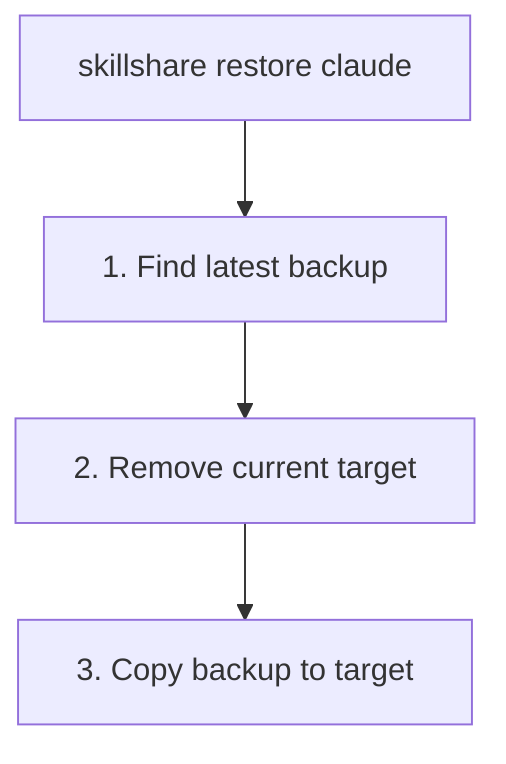

# Backup & Restore

Protect your skills and recover from mistakes.

## Overview

skillshare maintains automatic backups and provides manual backup/restore commands.


---

## Automatic Backups

Backups are created automatically before:

- `skillshare sync` (skill targets and agent targets)
- `skillshare sync agents` (agent targets only)
- `skillshare target remove`

**Location:** `~/.local/share/skillshare/backups/<timestamp>/` (agent backups appear as `<target>-agents/` next to the regular `<target>/` directories).

**Scope:** Only local target content is captured. Merge-mode symlinks are skipped because they point into your source — `sync` recreates them. See [What Gets Backed Up](/docs/reference/commands/backup#what-gets-backed-up).

---

## Manual Backup

### All targets

```bash
skillshare backup
```

### Specific target

```bash
skillshare backup claude
```

### Preview

```bash
skillshare backup --dry-run
```

---

## List Backups

```bash
skillshare backup --list
```

**Example output:**
```text
All backups in ~/.local/share/skillshare/backups (56.3 KB total)
─────────────────────────────────────────
  2026-09-28_12-52-50  claude, claude-work, cursor, gemini, opencode, universal   11.3 KB  ~/.local/share/skillshare/backups/2026-09-28_12-52-50
  2026-09-28_12-41-50  claude, claude-work, cursor, gemini, opencode, universal   11.2 KB  ~/.local/share/skillshare/backups/2026-09-28_12-41-50
  2026-09-28_12-39-56  claude, claude-work, cursor, gemini, opencode, universal   11.2 KB  ~/.local/share/skillshare/backups/2026-09-28_12-39-56
```

In the dashboard, **Settings → Backup → Target folders** lists the same snapshots:


---

## Restore

### From latest backup

```bash
skillshare restore claude
```

### From specific backup

```bash
skillshare restore claude --from 2026-01-19_10-00-00
```

### Preview

```bash
skillshare restore claude --dry-run
```

---

## What Restore Does



**Note:** After restore, the target contains real files (not symlinks). Run `skillshare sync` to re-establish symlinks.

---

## Cleanup Old Backups

```bash
skillshare backup --cleanup
```

Removes backups older than the configured retention period. Retention already runs automatically after every `sync`, so this is only for pruning on demand.

To check how much space snapshots use:

```bash
du -sh ~/.local/share/skillshare/backups
skillshare backup --cleanup --dry-run   # Preview what would be removed
```

See [Backups & Disk Space](/docs/reference/commands/backup#backups--disk-space) for how backup scope differs from `.gitignore` and `ignore:`.

---

## Recovery Scenarios

### Accidentally deleted a skill through symlink

```bash
# If git is initialized (recommended)
cd ~/.config/skillshare/skills
git checkout -- deleted-skill/

# Or restore from backup
skillshare restore claude
skillshare sync
```

### Messed up sync mode

```bash
skillshare restore claude
skillshare target claude --mode merge
skillshare sync
```

### Want to undo recent changes

```bash
skillshare backup --list
skillshare restore claude --from <earlier-timestamp>
```

### Recover an agent

Agents have their own backup entries (`<target>-agents`) and follow the same flow as skills:

```bash
# Manual agent backup
skillshare backup agents claude

# Restore from latest
skillshare restore agents claude

# Restore from a specific timestamp
skillshare restore agents claude --from 2026-01-19_10-00-00
```

In project mode, only agents can be backed up or restored — `skillshare backup -p agents` works, but plain `skillshare backup -p` errors. See [backup](/docs/reference/commands/backup#agent-backup) for the project-mode rule.

### Get back an earlier version of a file

skillshare also keeps earlier versions of single files it rewrites, such as `AGENTS.md`, `CLAUDE.md` and the locations of shared files:

```bash
skillshare backup files                               # Files with saved versions
skillshare backup files show ~/.claude/CLAUDE.md      # Pick a version ID
skillshare backup files restore ~/.claude/CLAUDE.md <id>
```

The dashboard has the same under **Settings › Backup › Files**, with a diff before restoring. See [File History](/docs/reference/commands/backup#file-history).

---

## Best Practices

### Before risky operations

```bash
skillshare backup
```

### After major changes

```bash
skillshare push -m "Major update"  # Git backup
```

### Weekly maintenance

```bash
skillshare backup --cleanup
```

---

## Git as Backup

Git provides an additional backup layer:

```bash
# Recover deleted skill
cd ~/.config/skillshare/skills
git checkout -- deleted-skill/

# See history
git log --oneline

# Restore to previous commit
git checkout <commit-hash> -- specific-skill/
```

---

## See Also

- [backup](/docs/reference/commands/backup) — Backup command reference
- [restore](/docs/reference/commands/restore) — Restore command reference
- [trash](/docs/reference/commands/trash) — Soft-delete management
- [Troubleshooting](/docs/troubleshooting) — When things go wrong
