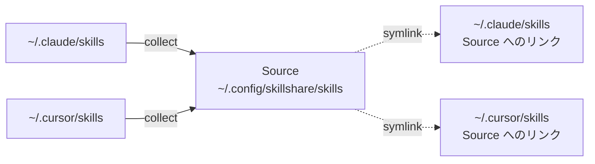

# 既存の Skills から移行する

すでに `~/.claude/skills/`、`~/.cursor/skills/`、その他の AI CLI ディレクトリに Skill が散らばっている状態を想定しています。このガイドでは、それらを 1 つの Source に統合し、元の場所を symlink に置き換えます。

```text
BEFORE                                  AFTER
─────────────────────────────────────────────────────────────────
~/.claude/skills/                       Source (one source of truth)
  ├── skill-a/                          ~/.config/skillshare/skills/
  └── skill-b/                            ├── skill-a/
                                          ├── skill-b/
~/.cursor/skills/                         ├── skill-c/
  ├── skill-b/  (duplicate!)              └── skill-d/
  └── skill-c/
                                        Targets (symlinked back)
~/.codex/skills/                        ~/.claude/skills/ → source
  └── skill-d/                          ~/.cursor/skills/ → source
                                        ~/.agents/skills/ → source
```

:::caution 先にバックアップを
`collect` は Target ディレクトリを書き換えます。ローカルの Skill は symlink に置き換えられます。あとから何か不都合が見つかったときに `skillshare restore <target>` で元に戻せるよう、collect の前に必ず `skillshare backup` を実行してください。
:::

## どの手順が当てはまるか

| あなたの状況 | 手順 |
|---|---|
| Skill が 1 つの CLI にだけある | [単一 CLI からの移行](#single-cli-migration) |
| Skill が複数の CLI に分散している | [複数 CLI の統合](#multi-cli-consolidation) |
| すでに別の場所に Skill の git リポジトリがある | [既存リポジトリに接続する](#connect-an-existing-repo) |

---

## 単一 CLI からの移行 {#single-cli-migration}

すべての Skill が 1 つの Target（たとえば Claude）にある場合は、`init --copy-from` が 1 ステップで処理します:

```bash
skillshare init --copy-from claude
skillshare sync
```

`--copy-from claude` は init の際に `~/.claude/skills/` のすべての Skill を Source にコピーします。続く `sync` が、元の場所を Source を指す symlink に置き換えます。

---

## 複数 CLI の統合 {#multi-cli-consolidation}

Skill が複数の Target に散らばっている場合です。空の状態で初期化し、スナップショットを取ってから、各 Target に対して `collect` を実行します。

```bash
# 1. 空の状態で初期化
skillshare init --no-copy

# 2. 書き換える前にすべての Target のスナップショットを取る
skillshare backup

# 3. collect — まとめて一度に、または Target ごとに
skillshare collect --all
#   または:
#   skillshare collect claude
#   skillshare collect cursor

# 4. sync — Target が Source への symlink になる
skillshare sync
```

`collect` が各 Target に対して行うこと:

1. symlink ではないローカルの Skill を Source にコピーします（Skill 内の `.git/` はスキップします）。
2. 元の場所を Source を指す symlink に置き換えます。
3. 重複（同じ Skill 名が複数の Target に存在する状態）を検出し、上書きせずに報告します。

Skill は Source にコピーされ、元の場所は Source へのリンクに置き換わります:



### 重複を解消する

Source と collect 対象の Target の両方に同じ Skill が存在する場合、Target 側はスキップされ、次のように報告されます:

```
Warning: skill-b exists in source
  Source:  ~/.config/skillshare/skills/skill-b/
  Skipped: ~/.cursor/skills/skill-b/
```

解消は手作業です。2 つのコピーを diff し、Source に残したい方を決めます。そのうえで Target 側はそのままにしておく（次回の `sync` で symlink に置き換わります）か、Target 側を採用したい場合は `collect --force` を再実行します。

---

## 既存リポジトリに接続する {#connect-an-existing-repo}

（以前のマシンなどで作った）Skill リポジトリがすでに GitHub にある場合、`collect` は不要です。クローンするだけで済みます:

```bash
skillshare init --remote git@github.com:you/skills.git --all-targets --no-skill
skillshare sync
```

tracked な依存は gitignore されているため、クローンには含まれません。init のあとに再インストールしてください:

```bash
skillshare install https://github.com/your-company/skills --track --force
skillshare sync
```

---

## 移行した Source を git に push する

移行が済んだら、Source をバージョン管理下に置きましょう。今後のマシンでも同じ方法で復元できるようになります。

```bash
# init で --remote をすでに指定している場合はこの手順は不要です。
cd ~/.config/skillshare/skills
git remote add origin git@github.com:you/skills.git

skillshare push -m "Initial commit: migrated skills"
```

以降は `skillshare push` と `skillshare pull` でマシン間の Skill をやり取りします。

---

## 確認

```bash
skillshare status     # すべての Target が 'synced' と表示されるはず
skillshare list       # collect した Skill がすべて表示されるはず
skillshare doctor     # 診断 — 壊れた symlink、見つからない Target など
```

## ロールバック

先に `backup` を実行してあるため、`collect` は元に戻せます:

```bash
skillshare restore claude
skillshare restore cursor
```

各 Target は collect 前の状態——symlink ではない実ファイル——に戻ります。

---

## 関連項目

- [Daily Workflow](/docs/how-to/daily-tasks/daily-workflow) — 移行後の日々の運用
- [Cross-Machine Sync](/docs/how-to/sharing/cross-machine-sync) — git による同期
- [Core Concepts](/docs/understand) — Source と Target の関係
