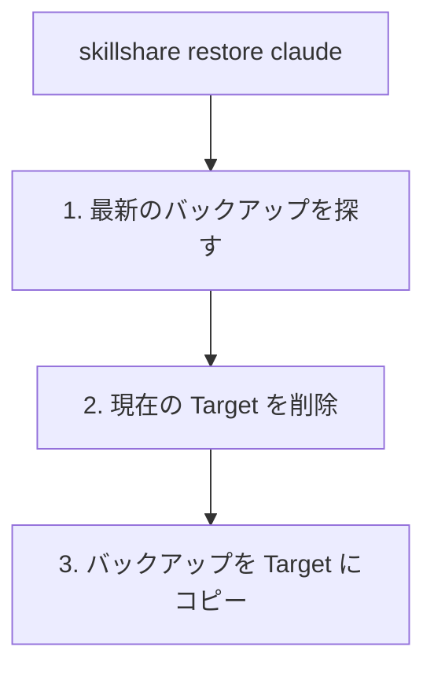

# バックアップと復元

Skill を保護し、ミスから復旧します。

## 概要

skillshare は自動バックアップを維持し、手動のバックアップ/復元コマンドも提供します。


---

## 自動バックアップ

バックアップは以下の前に自動的に作成されます。

- `skillshare sync`（Skill の Target と Agent の Target）
- `skillshare sync agents`（Agent の Target のみ）
- `skillshare target remove`

**場所:** `~/.local/share/skillshare/backups/<timestamp>/`（Agent のバックアップは通常の `<target>/` ディレクトリの隣に `<target>-agents/` として表示されます）。

**範囲:** ローカルの Target の内容のみが対象です。Merge モードのシンボリックリンクは Source を指しているためスキップされます — `sync` がそれらを再作成します。詳しくは [What Gets Backed Up](/docs/reference/commands/backup#what-gets-backed-up) を参照してください。

---

## 手動バックアップ

### すべての Target

```bash
skillshare backup
```

### 特定の Target

```bash
skillshare backup claude
```

### プレビュー

```bash
skillshare backup --dry-run
```

---

## バックアップの一覧表示

```bash
skillshare backup --list
```

**出力例:**
```text
All backups in ~/.local/share/skillshare/backups (56.3 KB total)
─────────────────────────────────────────
  2026-09-28_12-52-50  claude, claude-work, cursor, gemini, opencode, universal   11.3 KB  ~/.local/share/skillshare/backups/2026-09-28_12-52-50
  2026-09-28_12-41-50  claude, claude-work, cursor, gemini, opencode, universal   11.2 KB  ~/.local/share/skillshare/backups/2026-09-28_12-41-50
  2026-09-28_12-39-56  claude, claude-work, cursor, gemini, opencode, universal   11.2 KB  ~/.local/share/skillshare/backups/2026-09-28_12-39-56
```

ダッシュボードでは **Settings → Backup → Target folders** に同じスナップショットが並びます。


---

## 復元

### 最新のバックアップから

```bash
skillshare restore claude
```

### 特定のバックアップから

```bash
skillshare restore claude --from 2026-01-19_10-00-00
```

### プレビュー

```bash
skillshare restore claude --dry-run
```

---

## 復元の仕組み



**注意:** 復元後、Target にはシンボリックリンクではなく実ファイルが含まれます。シンボリックリンクを再構築するには `skillshare sync` を実行してください。

---

## 古いバックアップのクリーンアップ

```bash
skillshare backup --cleanup
```

設定された保持期間より古いバックアップを削除します。保持処理はすでに `sync` のたびに自動実行されているため、これはオンデマンドでの整理専用です。

スナップショットが使用しているディスク容量を確認するには:

```bash
du -sh ~/.local/share/skillshare/backups
skillshare backup --cleanup --dry-run   # 削除対象をプレビュー
```

バックアップの範囲が `.gitignore` や `ignore:` とどう異なるかは、[Backups & Disk Space](/docs/reference/commands/backup#backups--disk-space) を参照してください。

---

## 復旧シナリオ

### シンボリックリンク経由で誤って Skill を削除した

```bash
# git が初期化されている場合（推奨）
cd ~/.config/skillshare/skills
git checkout -- deleted-skill/

# またはバックアップから復元
skillshare restore claude
skillshare sync
```

### Sync モードを間違えた

```bash
skillshare restore claude
skillshare target claude --mode merge
skillshare sync
```

### 最近の変更を取り消したい

```bash
skillshare backup --list
skillshare restore claude --from <earlier-timestamp>
```

### Agent を復旧する

Agent は独自のバックアップエントリ（`<target>-agents`）を持ち、Skill と同じフローに従います。

```bash
# 手動での Agent バックアップ
skillshare backup agents claude

# 最新から復元
skillshare restore agents claude

# 特定のタイムスタンプから復元
skillshare restore agents claude --from 2026-01-19_10-00-00
```

Project mode では Agent のみバックアップ・復元が可能です — `skillshare backup -p agents` は動作しますが、単純な `skillshare backup -p` はエラーになります。Project mode のルールについては [backup](/docs/reference/commands/backup#agent-backup) を参照してください。

### ファイルの以前のバージョンを取り戻す

skillshare は、`AGENTS.md`、`CLAUDE.md`、共有ファイルの配置先など、書き換える単一ファイルの以前のバージョンも保存しています。

```bash
skillshare backup files                               # 保存済みバージョンがあるファイル
skillshare backup files show ~/.claude/CLAUDE.md      # バージョン ID を選ぶ
skillshare backup files restore ~/.claude/CLAUDE.md <id>
```

ダッシュボードでも **設定 › バックアップ › ファイル** で同じことができ、復元前に差分を確認できます。[ファイル履歴](/docs/reference/commands/backup#file-history) を参照してください。

---

## ベストプラクティス

### リスクのある操作の前に

```bash
skillshare backup
```

### 大きな変更の後に

```bash
skillshare push -m "Major update"  # Git バックアップ
```

### 週次メンテナンス

```bash
skillshare backup --cleanup
```

---

## バックアップとしての Git

Git は追加のバックアップレイヤーを提供します。

```bash
# 削除された Skill を復旧
cd ~/.config/skillshare/skills
git checkout -- deleted-skill/

# 履歴を確認
git log --oneline

# 以前のコミットに復元
git checkout <commit-hash> -- specific-skill/
```

---

## 関連項目

- [backup](/docs/reference/commands/backup) — Backup コマンドリファレンス
- [restore](/docs/reference/commands/restore) — Restore コマンドリファレンス
- [trash](/docs/reference/commands/trash) — ソフトデリート管理
- [トラブルシューティング](/docs/troubleshooting) — 問題が起きたとき
