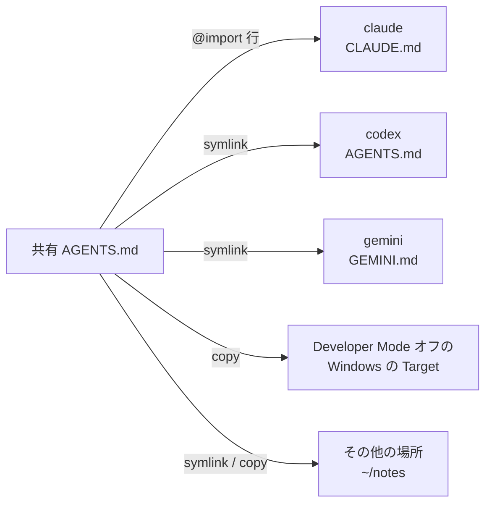

# 1 つの AGENTS.md をツール間で共有する

AI ツールはそれぞれ、自身のファイルから常に従う指示を読み込みます。Claude Code は `CLAUDE.md`、
Gemini CLI は `GEMINI.md`、Codex やほとんどのツールは `AGENTS.md` を、それぞれ自身のフォルダーから
読み込みます。Web ダッシュボード（`skillshare ui`）はこれらのファイルを表示・編集でき、複数のツールに
1 つの共有 `AGENTS.md` を渡すこともできます。

これはダッシュボードの機能で、専用の CLI コマンドはありません。共有 `AGENTS.md` は
[Extras](../../reference/commands/extras.md#single-file-extras) として保存されるため、
`skillshare sync extras` でも配置が維持されます。

## Target が読むファイルを確認する {#see-what-a-target-reads}

**ターゲット** から Target を開きます。そのページには、その Target が読むファイル名のタブがあります。
claude なら **CLAUDE.md**、gemini なら **GEMINI.md**、codex なら **AGENTS.md** です。
タブには上から順に次の内容が表示されます。

- ファイルのパスとサイズ、および **場所を変更**（[後述](#change-which-file-a-target-reads)）、
  **変換…**、**保存**。
- **読み込み順** の 1 行: ツールが読み込むファイルを読み込む順に並べ、それぞれ読み込まれるかどうかを
  示します（ホバーすると `loaded`、`skipped`、`missing` が表示されます）。claude の場合は
  `~/.claude/rules/` 内の Markdown ファイル（そのフォルダーにファイルがある場合のみ。空の rules フォルダーは
  表示されません）と、claude がユーザーレベルの `AGENTS.md` を読まないという
  注記も含まれます。global モードでは、同じ行の末尾に **共有 AGENTS.md** が表示されます。この Target が
  使う共有ファイルと、それを選ぶためのリンクです。
- ファイルのエディタ。**編集** と **プレビュー** のタブがあり、**プレビュー** は未保存の編集も含めて
  Markdown を表示します。長い行は折り返されます。**保存**（または ⌘S / Ctrl+S）は現在のファイルを先にバックアップし、
  ファイルがまだなければ作成します。
  `@` で始まる行は import で、展開するのは一部のツールだけです。他のツールはそれをただのテキストとして
  読みます。エディタはこれらの行に色を付け、どのツールが展開するかを示す短い注記を添えます。
- 警告。Windsurf はグローバルな rules ファイルの先頭 6,000 文字しか読み込みません。


ファイルが共有 `AGENTS.md` へのリンクの場合、エディタは読み取り専用になります。編集するとその共有
ファイルを使うすべての Target が変わるため、そのファイル専用のページで編集してください。dotfiles への
リンクなど、自分で作ったリンクは編集でき、保存するとリンク先のファイルに書き込まれます。

skillshare が把握しているファイルは次のとおりです。

| Target | ユーザーレベルのファイル | プロジェクトのファイル | `@` import に従う |
|--------|-----------------|--------------|---------------------|
| amp | `~/.config/amp/AGENTS.md` | `AGENTS.md` | いいえ |
| antigravity | `~/.gemini/GEMINI.md`（gemini と同じファイル） | `AGENTS.md` | いいえ |
| antigravity-cli | `~/.gemini/GEMINI.md`（gemini と同じファイル） | `AGENTS.md` | いいえ |
| claude | `~/.claude/CLAUDE.md` と `~/.claude/rules/` | `CLAUDE.md`（`CLAUDE.md` がなければ `AGENTS.md`）と `.claude/rules/` | はい |
| cline | `~/.agents/AGENTS.md`（universal と同じファイル）と `~/Documents/Cline/Rules/` | `AGENTS.md` と `.clinerules/` | いいえ |
| codebuddy | `~/.codebuddy/CODEBUDDY.md` と `~/.codebuddy/rules/` | `CODEBUDDY.md`（`CODEBUDDY.md` がなければ `AGENTS.md`）と `.codebuddy/rules/` | はい |
| codex | `~/.codex/AGENTS.md` | `AGENTS.md` | いいえ |
| commandcode | `~/.commandcode/AGENTS.md` | `AGENTS.md` | はい |
| copilot | `~/.copilot/copilot-instructions.md` | `.github/copilot-instructions.md` | いいえ |
| cursor | なし: ユーザールールは Cursor の設定内に保存される | `AGENTS.md` | いいえ |
| deepagents | `~/.deepagents/agent/AGENTS.md` | `.deepagents/AGENTS.md` | いいえ |
| devin | `~/.config/devin/AGENTS.md` | `AGENTS.md` | いいえ |
| droid | `~/.factory/AGENTS.md` | `AGENTS.md` | いいえ |
| firebender | `~/.firebender/AGENTS.md` | `AGENTS.md` | いいえ |
| forgecode | `~/forge/AGENTS.md` | `AGENTS.md` | いいえ |
| gemini | `~/.gemini/GEMINI.md` | `GEMINI.md` | いいえ |
| goose | `~/.config/goose/.goosehints` | `AGENTS.md` | いいえ |
| grok | `~/.grok/AGENTS.md` と `~/.grok/rules/` | `AGENTS.md` と `.grok/rules/` | いいえ |
| iflow | `~/.iflow/IFLOW.md` | `IFLOW.md` | はい |
| junie | `~/.junie/AGENTS.md` | `AGENTS.md` | いいえ |
| kiro | `~/.kiro/steering/AGENTS.md` | `AGENTS.md` | いいえ |
| omp | `~/.omp/agent/AGENTS.md` | `AGENTS.md` | はい |
| opencode | `~/.config/opencode/AGENTS.md` | `AGENTS.md` | いいえ |
| pi | `~/.pi/agent/AGENTS.md` | `AGENTS.md` | いいえ |
| pochi | `~/.pochi/README.pochi.md` | `AGENTS.md` | いいえ |
| qoder | `~/.qoder/AGENTS.md` と `~/.qoder/rules/` | `AGENTS.md` と `.qoder/rules/` | はい |
| qwen | `~/.qwen/QWEN.md` | `QWEN.md` | はい |
| roo | `~/.roo/rules/AGENTS.md` | `AGENTS.md` | いいえ |
| rovodev | `~/.rovodev/AGENTS.md` | `AGENTS.md` | いいえ |
| universal | `~/.agents/AGENTS.md` | `AGENTS.md` | いいえ |
| verdent | `~/.verdent/VERDENT.md` | `AGENTS.md` | いいえ |
| vibe | `~/.vibe/AGENTS.md` | `AGENTS.md` | いいえ |
| warp | `~/.agents/AGENTS.md`（universal と同じファイル） | `AGENTS.md` | いいえ |
| windsurf | `~/.codeium/windsurf/memories/global_rules.md`（先頭 6,000 文字） | `AGENTS.md` | いいえ |
| zed | `~/.config/zed/AGENTS.md` | `AGENTS.md` | いいえ |

Claude、Codex、Pi の[別のアカウント](../../reference/targets/configuration.md#agent-config-dir)は、
自身の Config ディレクトリ内の同じファイル（例: `~/.claude-work/CLAUDE.md`）を読みます。その他の
Target については、[どのファイルを読むかを skillshare に教えます](#tools-skillshare-doesnt-know)。

## universal 経由で skills を読むツール {#tools-that-read-skills-through-universal}

多くのツールが、universal Target のフォルダーである `~/.agents/skills` から skills を読みます。
Codex と Goose はこれを自身の skills フォルダーとして使い、Gemini CLI、Pi、OpenCode などは自身の
フォルダーに加えてこれも読みます。universal 経由で skills を同期し、これらを Target として追加して
いない場合でも、各ツールが読む指示ファイルは `~/.agents/AGENTS.md` ではなく自身のファイルです。
たとえば Codex は `~/.codex/AGENTS.md`、Gemini CLI は `~/.gemini/GEMINI.md` を読みます。

global モードでは、universal の **AGENTS.md** タブの左側に、管理するファイルが一覧表示されます。先頭は
universal 自身のファイルで、その後にインストール済みのこうしたツールが続きます。skillshare は `~/.codex` や
`~/.gemini` などのフォルダーがあるかどうかで判断します。各行には、ファイルがすでにあるかどうかが
表示されます。1 つ選ぶと、そのツール自身のファイルを確認・編集できます。選択は URL に `?tool=<name>` として
残ります。**Extras** の共有 AGENTS.md の一覧にも表示されるので、共有ファイルを
つなぐこともできます。Target の設定がないため、ファイルの場所は変更できません。一覧にないツールは、
独自の Target として追加できます。

Cline や Warp Agent CLI など、`~/.agents/AGENTS.md` そのものを読むツールもあります。Codex、
Gemini CLI、Pi は自身のファイルを読みます。

## CLAUDE.md を AGENTS.md に変換する {#convert-claudemd-to-agentsmd}

Target のタブで **変換…** をクリックすると、その内容を他のツールでも読めるようにできます。このボタンは、
ファイルに移動する内容があり、まだ `AGENTS.md` ではない場合に表示されます。ダイアログは何かを書き込む前に
すべての変更をプレビューし、変更または削除するファイルはそれぞれ先にバックアップされます。

| 方法 | 結果 | 使える場面 |
|--------|--------|-----------|
| **AGENTS.md に移動し、CLAUDE.md からインポート**（推奨） | 内容は `AGENTS.md` に移動します。`CLAUDE.md` には `@AGENTS.md` の行と、claude だけが解釈できる行だけが残ります | `@` import に従うツール（claude） |
| **CLAUDE.md を AGENTS.md に名前変更** | `CLAUDE.md` は削除され、claude は代わりに `AGENTS.md` を読みます | プロジェクトのみ。自身のファイルがないときに `AGENTS.md` を読むツールが対象です。`CLAUDE.local.md` がある間や、`CLAUDE.md` が共有 `AGENTS.md` を使っている間は拒否されます（次の sync で `CLAUDE.md` が再作成されるため） |
| **AGENTS.md にコピー** | 両方のファイルが残り別々に編集されるため、内容がずれていきます | 常に |

ファイル名は Target に合わせて変わります。gemini の場合、ダイアログは **AGENTS.md にコピー** だけを
提示します。1 つ目の方法では、**N 行の @import を CLAUDE.md に残す** がデフォルトでオンになっています。
他のツールはこれらの行をただのテキストとして読んでしまうためです。

ユーザーレベルでは、`~/.claude` 内の `AGENTS.md` を読む他のツールはありません。そのため global モードでは、
1 つ目の方法に **他のターゲットも使える共有 AGENTS.md にする** も表示され、デフォルトでオンになっています。

- **新しく作成…**: 新しい共有 `AGENTS.md` に名前を付けます。名前の初期値は `claude` のような Target 名です。
  内容はそこに移動し、`CLAUDE.md` がそれを import します。
- 既存の共有ファイル: 内容はそのファイルの末尾に追加され、`CLAUDE.md` がそれを import するようになります。

共有をオフにすると、内容は `~/.claude/AGENTS.md` に移動し、`CLAUDE.md` に `@AGENTS.md` の行が入ります。

ほかに選べる共有ファイルがない場合、**Convert…** では新しい名前だけを入力します。共有ファイルの選択欄は、ほかのファイルを選べる場合にのみ表示されます。

## global モードで 1 つの AGENTS.md を共有する {#share-one-agentsmd-in-global-mode}

**Extras** に移動し、**AGENTS.md** タブを開きます。**新しい共有 AGENTS.md** では、名前（英字、数字、
`-` と `_`）と開始元を指定します。

- **空のファイル**: ダイアログ内で最初の内容を書きます。
- **claude のファイルを移動**（または、ファイルがあり、まだ共有ファイルを使っていない他の Target）:
  Target の現在のファイルが共有ファイルに移動し、以後その Target は共有ファイルを使います。元のファイルは
  先にバックアップされます。

各共有ファイルは `<extras source>/<name>/AGENTS.md`（デフォルトでは
`~/.config/skillshare/extras/<name>/AGENTS.md`）に保存されます。

Target が共有ファイルをどう使うかは、`@` import に従うかどうかで決まります。

- **import する Target**（claude と、`@import` に対応すると設定したツール）は自身の内容を保持し、複数の
  共有ファイルを同時に使えます。skillshare はファイル先頭の管理ブロック内に、共有ファイルごとに 1 行を追加し、
  ブロックの外側は一切変更しません。Claude にはユーザーレベルの `AGENTS.md` がないため、このブロックが
  共有ファイルを読む手段になります。

  ```markdown title="~/.claude/CLAUDE.md"
  <!-- skillshare:instructions:begin -->
  @/Users/you/.config/skillshare/extras/personal/AGENTS.md
  <!-- skillshare:instructions:end -->

  Claude 専用の自分の指示はここに残ります。
  ```

- **その他の Target**（codex、gemini など）は 1 つの共有ファイルを使います。そのファイルはバックアップされ、
  共有ファイルへのリンク（シンボリックリンク）に置き換えられます。Developer Mode がオフの Windows では
  ファイルのリンクを使えないため、代わりにコピーに置き換えられます。

グローバルモードでは、1 つの共有ファイルが次のように各 Target に届きます:



タブの左側には共有ファイルが一覧され、それぞれに接続している Target が表示されます。どれかをクリックすると
右側に表示されます。パス、内容（既定はレンダリングされた **プレビュー**。**ソース** に切り替えると元のテキストを表示）、そしてスイッチ付きのすべての Target です。選択したファイルは
URL の一部になる（`/extras?tab=instructions&file=<name>`）ため、リンクからそのファイルを直接開けます。

- Target のスイッチをオンにすると接続されます。import する Target には import 行が 1 つ追加され、ほかの
  共有ファイルはそのまま残ります。すでに別の共有ファイルを使っている Target は、1 つしか使えないため、
  先に確認を求めます。
- スイッチをオフにすると Target が[復元](#restore-and-delete)されます。先に結果のプレビューが表示されます。
  import する Target では、このファイルの import 行だけが削除され、ほかの共有ファイルは残ります。
- **すべて接続** と **すべて復元** は、実行する前に、変更されるすべての Target を、それぞれに何が起こるかの
  説明とともに一覧します。一部の Target だけを変更するには、行にチェックを入れて、選択バーの **接続** または
  **復元** を使います。

特別な Target がいくつかあります。

- antigravity は gemini と同じ `~/.gemini/GEMINI.md` を読みます。両方が Target の場合、antigravity の
  行は gemini に従い、単独では変更できません。
- cline と warp は universal と同じ `~/.agents/AGENTS.md` を読みます。universal も Target の場合、
  これらの行は universal に従います。
- cursor は表示されません。ユーザールールはファイルではなく Cursor の設定に保存されます。

リンクまたは `copy` モードの Target ファイルが使える共有ファイルは 1 つだけで、別の共有ファイルを同時に import することはできません。**すべて接続** は、自分で作ったリンクも含め、別の共有ファイルが使用中の Target をスキップします。別のファイルにつなぐ前に、元の接続を復元してください。

## 1 つの共有ファイルを管理する {#manage-one-shared-file}

接続している各 Target にはモードの選択肢があり、ステータスが表示されます。モードは、Target が共有
ファイルをどう受け取るかを決めます。

| モード | Target のファイル | 使える場面 |
|------|-------------|-----------|
| `import` | 自分のファイルに、管理ブロック内の `@import` 行が 1 つ入ります。共有ファイルの変更はすぐに反映されます | `@` import に従う Target |
| `symlink` | 共有ファイルへのリンク。変更はすぐに反映されます | Developer Mode がオフの Windows 以外 |
| `copy` | 共有ファイルのコピー。ダッシュボードで共有ファイルを保存するとコピーも更新されます。ほかの場所で共有ファイルを編集した後は、このページの **Sync** で再度 sync します | 常に |


ファイルリンクを使えない場合、**Targets** の横の情報ツールチップに Windows Developer Mode の説明が表示されます。指示ファイルの警告とエラーはダッシュボードの言語で表示され、未知のコードでは元の英語メッセージが使われます。

選択肢にはデフォルトが示されます。`@` import に従う Target では `import`、それ以外では `symlink`、
Developer Mode がオフの Windows では `copy` です。複数の共有ファイルを使う Target は `import` しか
使えません。モードを変更すると、その Target はすぐに sync されます。`import` に戻すと、前回の `import` モードの自分の内容（未使用なら接続前の内容）が import ブロックとともに戻ります。

Windows では、ファイルがフォルダーとして作成されたリンクになっている Target に警告が表示されます。
ツールはこのファイルを読めません。`copy` に切り替える（または `skillshare sync extras` を実行する）と
直ります。[Windows のトラブルシューティング](../../troubleshooting/windows.md#agent-files-or-agentsmd-show-a-folder-icon-and-cant-be-read)
を参照してください。

モード変更で編集内容を置き換える場合、ダッシュボードはバックアップを通知します。`import` に戻すと、意図的に空にした場合も含め、最後に保存された自身の内容が保たれます。

| ステータス | 意味 |
|--------|---------|
| `synced` | リンク、コピー、または import 行が配置されている |
| `modified` | リンクが内容の異なる通常ファイルに置き換えられた、または管理対象のコピーが編集された ([後述](#when-a-linked-file-is-edited)) |
| `drift` | Target のファイルは存在するが、共有ファイルにリンクされていないか、import 行がなくなっている |
| `not synced` | Target のファイルがまだ存在しない |
| `no source` | 共有ファイル自体が見つからない |

Target のファイルパスにフォルダーがある場合は、そのフォルダーを削除または名前変更してから同期してください。同期はフォルダーを置き換えません。

接続している Target が `drift` または `not synced` の場合、見出しに同期が必要な数と **同期** ボタンが
表示されます。このボタンは、このファイルのリンク、コピー、import 行を再配置します。

**編集** は **編集** と **プレビュー** のタブがある大きなエディターでファイルを開きます。サイドパネルには、保存したファイルをすぐに読み込む Target が
一覧され、長いファイルの一部しか読み込まない Target があれば警告が表示されます。⌘S（Ctrl+S）で保存します。
以前のバージョンはバックアップされ、`copy` モードの Target にも新しい内容が反映されます。保存後のメッセージに
その Target が表示されます。

**⋯** メニューでは、ファイルのパスをコピーするか、共有ファイルを削除できます。

### 復元と削除 {#restore-and-delete}

Target を復元すると、共有ファイルをつなぐ前の状態に戻ります。元あったファイルやシンボリックリンクが
戻され、元々なかった場合はファイルが削除されます。

Target のスイッチをオフにすると、復元で何が起こるかが先に表示されます。

- 通常は、復元後のファイルの内容と、現在のファイルとの差分を表示するタブ。
- 元々ファイルがなかった場合は、復元するとファイルが削除されるという注記。
- 元々ファイルがリンクだった場合は、戻されるリンク。
- つないだ後にファイルを編集していた場合は、その編集は復元されないという注記。編集内容は
  [drift バックアップ](#backups)として保存されます。

なお、import する Target では、skillshare の import 行だけが削除されます。ブロックのためだけに skillshare が作成した `CLAUDE.md` は、空になった時点で削除されます。
共有ファイル自体は残ります。Target がまだ `modified` の場合、編集済みのファイルは先に
[drift バックアップ](#backups)として保存されます。

共有ファイルを削除すると、Config からそれが削除され、それを使っていたすべての Target が復元されます。
ファイル自体は extras フォルダーに残ります。

Windows では、元の junction は junction として復元され、Developer Mode や管理者権限は不要です。

自分で作成した junction を置き換えると、元の参照先が警告に表示されます。

## その他の場所 {#other-locations}

Target の下にある **その他の場所** には、共有ファイルの書き込み先のうち、リストにあるツールではない場所が
表示されます。Target ではないフォルダー（メモや dotfiles リポジトリなど）や、別のファイル名
（`instructions.md` など）です。`skillshare extras <name> --add-target <dir> --as <file>` と同じ動作で、
このコマンドで追加した場所もここに表示されます。

**場所を追加** では次を指定します。

- **フォルダー**: フルパス、または `~` で始まるパス。存在しない場合は作成されます。
- **ファイル名**: 空欄にすると共有ファイルの名前 `AGENTS.md` を使います。
- この場所がファイルを受け取る方法: `symlink`（デフォルト）、`copy`、`import`。`import` は、このファイルを
  読むツールが `@import` に対応していることをチェックした後にだけ選べます。対応していないツールには
  パスの行しか見えないためです。Developer Mode が無効な Windows では `symlink` を使えず、`copy` が
  デフォルトになります。

**追加して同期** はすぐにファイルを書き込みます。書き込めない場合は何も保存されません。次の場合、
skillshare は場所を追加しません。

- そのファイルパスにフォルダーがある。別のファイル名を使うか、先にフォルダーを移動してください。
- そのファイルがリストにあるツール自身の instruction ファイルである。代わりに **ターゲット** でそのツールを
  オンにしてください。
- そのファイルが別の共有ファイルをすでにリンクまたはコピーしている。先にその共有ファイルから削除するか、
  両方で `import` を使ってください。
- そのフォルダーがすでにこの共有ファイルの場所になっている。その行でモードを変更してください。

各行にはファイル、モードの選択、[ステータス](#manage-one-shared-file) が表示されます。モードを変更すると
その場所はすぐに同期されます。`drift` または `not synced` の場所は、見出しの **同期** ボタンの対象に
含まれます。**削除** はまず[復元プレビュー](#restore-and-delete)を表示し、**削除して復元** でファイルを
元の状態に戻して、その場所をリストから外します。`modified` の場所には Target の行と同じ 2 つのボタンがあり、
編集を取り込むか上書きできます ([後述](#when-a-linked-file-is-edited))。

プロジェクトでも場所は同じように動作します。[プロジェクトの共有ファイル](#shared-files-in-a-project)を参照してください。

## リンクされたファイルが編集された場合 {#when-a-linked-file-is-edited}

あなたやツールが Target のファイルを直接編集し、リンクが内容の異なる通常のファイルに置き換えられると、
ステータスは `modified` になり、行に 2 つの選択肢を含む注記が表示されます。

- 共有ファイル**に取り込む**: 編集内容が共有ファイルに反映され、それを使うすべての Target に届きます。
  現在の共有ファイルは先にバックアップされます。
- 共有ファイル**で上書き**: 編集されたファイルを [drift バックアップ](#backups)として保存し、リンクを
  戻します。ほかの Target には影響しません。

どちらの場合も、後で復元すると、Target は編集後の状態ではなく、共有ファイルを使う前の状態に戻ります。

`skillshare sync extras` と **同期** も、確認なしで `modified` のファイルに選択中のモードを再適用します。編集内容は
先に drift バックアップとして保存されるので、共有ファイルに反映させたい場合は sync の前に共有ファイル**に取り込む**を
選んでください。

管理対象の `copy` を編集した場合も `modified` となり、同じ **に取り込む** と **で上書き** を選べます。上書きや同期は選択中のモードを適用するため、`copy` の Target はコピーのままです。

## Target が読むファイルを変更する {#change-which-file-a-target-reads}

Target のタブで **場所を変更** をクリックすると、Target が読むファイルのパスとファイル名を変更できる
ダイアログが開きます。たとえば `~/.claude/CLAUDE.md` の代わりに `~/.claude/instructions.md` を読ませる
ことができます。ツールが `@` 行に従う場合は、**このツールは @import に対応** にチェックを入れます。
この設定は Target の [`instructions`](../../reference/targets/configuration.md#target-instructions)
として保存されます。**デフォルトに戻す** で、skillshare がその Target について把握しているファイルに戻ります。

Target が共有ファイルを使っている間、skillshare は場所の変更を拒否します。先に自身のファイルに戻して
ください。universal のタブに表示されるツールには Target の設定がないため、場所は変更できません。

パスにはファイルを指定してください。既存のディレクトリは指定できません。共有ファイルの接続中は **場所を変更** が無効になります。

## skillshare が把握していないツール {#tools-skillshare-doesnt-know}

[カスタム Target](../../reference/targets/adding-custom-targets.md) のように、既知のファイルがない Target
では、タブに **このツールが読むファイル** の入力欄が表示されます。

- global モードでは、フルパスか `~/` で始まるパスを入力します。
- プロジェクトでは、プロジェクトルートからの相対パスを入力します。

ツールが `@` 行に従う場合は、**このツールは @import に対応** にチェックを入れます。claude と同じように、
複数の共有ファイルを同時に使えるようになります。この設定は Target の
[`instructions`](../../reference/targets/configuration.md#target-instructions) として保存されます。ツールを追加するときに **ターゲットを追加** → **カスタムターゲット** で入力しておくこともできます。

後で更新するには **場所を変更** を使います。ダイアログには **設定を削除** もあります。設定を削除しても
ファイルは削除されません。Target が共有ファイルを使っている間、skillshare は場所の変更や削除を拒否します。
先に自身のファイルに戻してください。

## プロジェクト {#projects}

プロジェクト内で `skillshare ui -p` を実行します。プロジェクトでは、すべての Target がリポジトリで管理される
1 つの `./AGENTS.md` を読むため、共有や sync の必要はありません。**Extras** の **AGENTS.md** タブで
そのファイルを作成・編集でき、各 Target がそれを読み込めるかが表示されます。

| 読み込み方法 | 意味 |
|-------------------|---------|
| 直接読み込む | ツールのプロジェクトのファイルが `AGENTS.md` |
| CLAUDE.md がないため AGENTS.md を読み込む | claude が `AGENTS.md` にフォールバックする |
| CLAUDE.md がインポート | ツール自身のファイルに `@AGENTS.md` の行がある |
| GEMINI.md がリンク | ツール自身のファイルが `AGENTS.md` へのシンボリックリンク |
| CLAUDE.md があるため、claude は AGENTS.md を読み込みません | ツール自身のファイルが `AGENTS.md` を隠している |
| デフォルトでは GEMINI.md だけを読み込む | ツールは自身のファイルを読むが、そのファイルが存在しない |

自身のファイルしか読まないツールには、ワンクリックの修正が用意されています。**@AGENTS.md を追加** は
`CLAUDE.md` の先頭に import 行を追加し（先にバックアップします）、**GEMINI.md を追加** は `AGENTS.md` への
リンクとして `GEMINI.md` を作成します。

プロジェクトの `AGENTS.md` は 1 つなので、グループに分けられません。個人用と仕事用の指示を分けるには、
global モードで共有ファイルを使ってください。

Target のタブはプロジェクトでも使えます。その場合、読み込み順にはプロジェクトのファイルが表示され、
**変換…** では claude 向けに **名前変更** も選べます。

project モードの import は Target ファイルからの相対パスを使うため、リポジトリを移動しても機能します。

### プロジェクトの共有ファイル {#shared-files-in-a-project}

同じファイルをリポジトリ内の複数の場所（`./.gemini/GEMINI.md` と `./docs/ai/instructions.md` など）に置くには、
タブの下部にある **共有ファイル** を使います。共有ファイルは単一ファイルの extra で、その唯一のコピーは
`.skillshare/extras/<name>/` にあり、プロジェクトと一緒に commit されます。**新しい共有ファイル** で作成し、
各カードにはその場所が、[その他の場所](#other-locations)と同じ **場所を追加**、モードの選択、ステータス、
**削除** とともに表示されます。プロジェクトでの違いは次のとおりです。

- **フォルダー** はプロジェクトのルートからの相対パスです。ルート自体は `.` を使います。`../notes` や
  `~/notes` など、プロジェクト外のパスは拒否されます。
- ツール自身のファイルも使えます。たとえば `./CLAUDE.md` を `import` で使えます。
- リンクと import は相対パスを使うため、リポジトリを clone しても機能します。

単一ファイルの extras はここにだけ表示され、**フォルダー** タブには表示されません。カードのメニューの
**削除** は、まずすべての場所を復元してから、Config から extra を削除します。`.skillshare/extras/` 内の
ファイルは残ります。

## バックアップ {#backups}

skillshare は、ファイルを置き換える、削除する、またはあなたが書いた内容を変更する前に、そのファイルを
バックアップします。自身の import 行の追加や削除にはバックアップは不要です。各ファイルの最新 10 バージョンが
skillshare の state ディレクトリ（macOS と Linux では `~/.local/state/skillshare/extras/backups/`、
`$XDG_STATE_HOME` が設定されている場合は `$XDG_STATE_HOME/skillshare/extras/backups/`）に保存されます。

復元には、最新のバックアップではなく、共有ファイルをつないだ時点にあったものが使われます。同期、上書き、復元で
置き換えられた編集内容は、別の `drift/` フォルダー（`extras/backups/<id>/drift/`、`<id>` は Target の
ファイルのパスから導出）に保存されます。復元でこれらが戻されることはありません。

これらのバージョンを確認したり戻したりするには、ダッシュボードで **設定 › バックアップ › ファイル** を開くか、
[`skillshare backup files`](../../reference/commands/backup.md#file-history) を使います。
各バージョンには、`AGENTS.md` への変換や上書きなど、保存された理由が表示されます。**プレビューして復元** は、
先に現在のファイルと比較します。

共有ファイルの背後にある設定と、共有ファイルも扱う CLI コマンドについては、
[単一ファイルの Extras](../../reference/commands/extras.md#single-file-extras) を参照してください。
