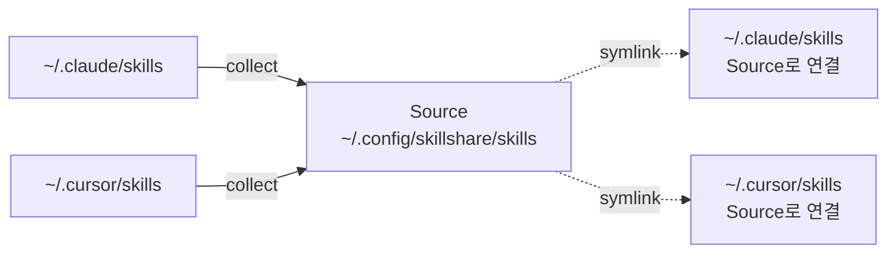

# 기존 Skill에서 시작하기

이미 `~/.claude/skills/`, `~/.cursor/skills/` 또는 다른 AI CLI 디렉터리에 Skill이 흩어져 있는 상황입니다. 이 가이드는 그것들을 하나의 Source로 통합하고, 원래 자리는 symlink(심볼릭 링크)로 대체합니다.

```text
BEFORE                                  AFTER
─────────────────────────────────────────────────────────────────
~/.claude/skills/                       Source (one source of truth)
  ├── skill-a/                          ~/.config/skillshare/skills/
  └── skill-b/                            ├── skill-a/
                                          ├── skill-b/
~/.cursor/skills/                         ├── skill-c/
  ├── skill-b/  (duplicate!)              └── skill-d/
  └── skill-c/
                                        Targets (symlinked back)
~/.codex/skills/                        ~/.claude/skills/ → source
  └── skill-d/                          ~/.cursor/skills/ → source
                                        ~/.agents/skills/ → source
```

:::caution 먼저 백업하세요
`collect`는 Target 디렉터리를 변경합니다. 로컬 Skill이 symlink로 대체됩니다. 나중에 무언가 이상해 보일 때 `skillshare restore <target>`으로 되돌릴 수 있도록, collect 전에 반드시 `skillshare backup`을 실행하세요.
:::

## 어떤 경로가 해당되나요

| 여러분의 상황 | 경로 |
|---|---|
| Skill이 CLI 하나에만 있는 경우 | [단일 CLI 마이그레이션](#single-cli-migration) |
| Skill이 여러 CLI에 흩어져 있는 경우 | [여러 CLI 통합](#multi-cli-consolidation) |
| 이미 다른 곳에 Skill git 리포지터리가 있는 경우 | [기존 리포지터리 연결](#connect-an-existing-repo) |

---

## 단일 CLI 마이그레이션 {#single-cli-migration}

모든 Skill이 하나의 Target(예: Claude)에만 있다면, `init --copy-from`이 한 번에 처리해 줍니다.

```bash
skillshare init --copy-from claude
skillshare sync
```

`--copy-from claude`는 init 과정에서 `~/.claude/skills/`의 모든 Skill을 Source로 복사합니다. 이어지는 `sync`가 원래 자리를 Source를 가리키는 symlink로 대체합니다.

---

## 여러 CLI 통합 {#multi-cli-consolidation}

Skill이 여러 Target에 흩어져 있는 경우입니다. 빈 상태로 초기화하고, 스냅샷을 만든 뒤, 각 Target에서 `collect`합니다.

```bash
# 1. 빈 상태로 초기화
skillshare init --no-copy

# 2. 변경하기 전에 모든 Target을 스냅샷
skillshare backup

# 3. Collect — 한 번에 전부, 또는 Target별로
skillshare collect --all
#   또는:
#   skillshare collect claude
#   skillshare collect cursor

# 4. Sync — 이제 Target이 Source를 symlink로 가리킵니다
skillshare sync
```

`collect`가 각 Target에 하는 일은 다음과 같습니다.

1. symlink가 아닌 로컬 Skill을 Source로 복사합니다 (Skill 내부의 `.git/`은 건너뜁니다).
2. 원래 자리를 Source를 가리키는 symlink로 대체합니다.
3. 중복(같은 Skill 이름이 여러 Target에 나타나는 경우)을 감지해, 덮어쓰지 않고 보고합니다.

Skill은 Source로 복사되고, 원래 위치는 Source를 가리키는 링크로 바뀝니다.



### 중복 해결하기

Source와 collect 대상 Target 양쪽에 같은 Skill이 있으면, Target 쪽 버전은 건너뛰고 다음과 같이 보고됩니다.

```
Warning: skill-b exists in source
  Source:  ~/.config/skillshare/skills/skill-b/
  Skipped: ~/.cursor/skills/skill-b/
```

직접 해결하세요. 두 사본을 diff해 보고 원하는 쪽을 Source에 남긴 다음, Target 쪽 버전은 그대로 두거나(다음 `sync`에서 symlink로 대체됩니다), Target 쪽 버전을 쓰고 싶다면 `collect --force`를 다시 실행하세요.

---

## 기존 리포지터리 연결 {#connect-an-existing-repo}

GitHub에 이미 Skill 리포지터리가 있다면(예전 머신에서 만든 것이라도) `collect`하지 말고 그냥 클론하세요.

```bash
skillshare init --remote git@github.com:you/skills.git --all-targets --no-skill
skillshare sync
```

Tracked 의존성은 gitignore되어 있으므로 클론할 때 함께 내려오지 않습니다. init 이후에 다시 설치하세요.

```bash
skillshare install https://github.com/your-company/skills --track --force
skillshare sync
```

---

## 마이그레이션한 Source를 git에 push하기

마이그레이션이 끝나면 Source를 버전 관리에 올려, 앞으로 다른 머신에서도 같은 방식으로 복구할 수 있게 하세요.

```bash
# init 중에 이미 --remote를 지정했다면 이 단계는 건너뛰세요.
cd ~/.config/skillshare/skills
git remote add origin git@github.com:you/skills.git

skillshare push -m "Initial commit: migrated skills"
```

그 이후로는 `skillshare push`와 `skillshare pull`로 머신 간에 Skill을 옮길 수 있습니다.

---

## 확인

```bash
skillshare status     # 모든 Target이 'synced'로 보고되어야 합니다
skillshare list       # collect한 모든 Skill이 나타나야 합니다
skillshare doctor     # 진단 — 끊어진 symlink, 누락된 Target 등
```

## 롤백

먼저 `backup`을 실행해 두었기 때문에 `collect`는 되돌릴 수 있습니다.

```bash
skillshare restore claude
skillshare restore cursor
```

각 Target이 collect 이전 상태, 즉 symlink가 아닌 실제 파일 상태로 돌아갑니다.

---

## 함께 보기

- [일상 워크플로](/docs/how-to/daily-tasks/daily-workflow) — 마이그레이션 이후의 평소 사용법
- [머신 간 Sync](/docs/how-to/sharing/cross-machine-sync) — git으로 동기화하기
- [핵심 개념](/docs/understand) — Source와 Target의 관계
