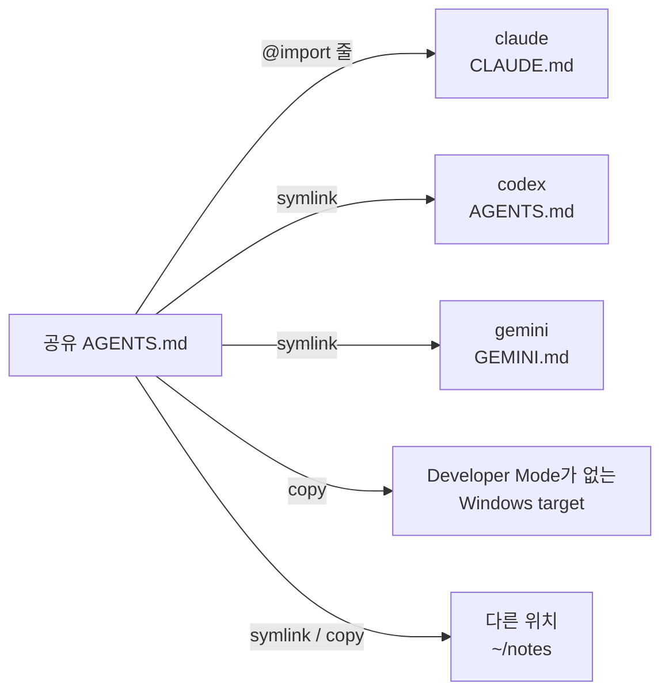

# 여러 도구에서 하나의 AGENTS.md 공유하기

AI 도구는 저마다 자기 파일에서 상시 지침을 읽습니다. Claude Code는 `CLAUDE.md`를,
Gemini CLI는 `GEMINI.md`를, Codex와 대부분의 다른 도구는 `AGENTS.md`를 각자의 폴더에서
읽습니다. 웹 대시보드(`skillshare ui`)는 이 파일들을 보여 주고 편집할 수 있게 하며,
여러 도구가 하나의 공유 `AGENTS.md`를 쓰도록 설정할 수 있습니다.

이 기능은 대시보드 전용이며 별도의 CLI 명령은 없습니다. 공유 `AGENTS.md`는
[extra](../../reference/commands/extras.md#single-file-extras)로 저장되므로
`skillshare sync extras`로도 제자리에 유지됩니다.

## target이 읽는 파일 확인하기 {#see-what-a-target-reads}

**대상**에서 target을 여세요. 페이지에는 그 target이 읽는 파일 이름을 딴 탭이 있습니다.
claude는 **CLAUDE.md**, gemini는 **GEMINI.md**, codex는 **AGENTS.md**입니다.
탭에는 위에서부터 다음이 표시됩니다:

- 파일 경로와 크기, 그리고 **위치 변경**([아래 참고](#change-which-file-a-target-reads)),
  **변환…**, **저장**.
- **읽는 순서** 한 줄: 도구가 불러오는 파일을 불러오는 순서대로 보여 주며, 각 파일이
  불러와졌는지 표시합니다(마우스를 올리면 `loaded`, `skipped`, `missing`이 보입니다).
  claude의 경우 `~/.claude/rules/`에 Markdown 파일이 있으면 그 파일들(비어 있는 rules 폴더는
  표시되지 않음)과, claude가 사용자 레벨 `AGENTS.md`를
  읽지 않는다는 안내도 포함됩니다. global 모드에서는 같은 줄 끝에 **공유 AGENTS.md**가
  있으며, 이 target이 사용하는 공유 파일과 공유 파일을 선택하는 링크가 표시됩니다.
- **편집**과 **미리 보기** 탭이 있는 파일 편집기. **미리 보기**는 저장하지 않은 편집을 포함해
  Markdown을 렌더링합니다. 긴 줄은 줄바꿈됩니다. **저장**(또는 ⌘S / Ctrl+S)은 먼저 현재 파일을 백업하며, 파일이
  아직 없으면 새로 만듭니다.
  `@`로 시작하는 줄은 import이며, 이를 펼치는 도구는 일부뿐입니다. 다른 도구는 일반
  텍스트로 읽습니다. 편집기는 이런 줄에 색을 입히고, 어떤 도구가 펼치는지 짧은 안내를
  덧붙입니다.
- 경고. Windsurf는 전역 rules 파일의 처음 6,000자만 읽습니다.


파일이 공유 `AGENTS.md`에 대한 링크이면 편집기는 읽기 전용입니다. 여기서 편집하면 그
공유 파일을 쓰는 모든 target이 바뀌므로, 해당 파일의 페이지에서 편집하세요. dotfiles로
연결한 링크처럼 직접 만든 링크는 계속 편집할 수 있으며, 저장하면 링크가 가리키는
파일에 기록됩니다.

skillshare가 알고 있는 지침 파일은 다음과 같습니다:

| Target | 사용자 레벨 파일 | 프로젝트 파일 | `@` import 지원 |
|--------|-----------------|--------------|---------------------|
| amp | `~/.config/amp/AGENTS.md` | `AGENTS.md` | No |
| antigravity | `~/.gemini/GEMINI.md` (gemini와 같은 파일) | `AGENTS.md` | No |
| antigravity-cli | `~/.gemini/GEMINI.md` (gemini와 같은 파일) | `AGENTS.md` | No |
| claude | `~/.claude/CLAUDE.md`, 그리고 `~/.claude/rules/` | `CLAUDE.md`, `CLAUDE.md`가 없으면 `AGENTS.md`, 그리고 `.claude/rules/` | Yes |
| cline | `~/.agents/AGENTS.md` (universal과 같은 파일), 그리고 `~/Documents/Cline/Rules/` | `AGENTS.md`, 그리고 `.clinerules/` | No |
| codebuddy | `~/.codebuddy/CODEBUDDY.md`, 그리고 `~/.codebuddy/rules/` | `CODEBUDDY.md`, `CODEBUDDY.md`가 없으면 `AGENTS.md`, 그리고 `.codebuddy/rules/` | Yes |
| codex | `~/.codex/AGENTS.md` | `AGENTS.md` | No |
| commandcode | `~/.commandcode/AGENTS.md` | `AGENTS.md` | Yes |
| copilot | `~/.copilot/copilot-instructions.md` | `.github/copilot-instructions.md` | No |
| cursor | 없음: 사용자 rules는 Cursor 설정에 있음 | `AGENTS.md` | No |
| deepagents | `~/.deepagents/agent/AGENTS.md` | `.deepagents/AGENTS.md` | No |
| devin | `~/.config/devin/AGENTS.md` | `AGENTS.md` | No |
| droid | `~/.factory/AGENTS.md` | `AGENTS.md` | No |
| firebender | `~/.firebender/AGENTS.md` | `AGENTS.md` | No |
| forgecode | `~/forge/AGENTS.md` | `AGENTS.md` | No |
| gemini | `~/.gemini/GEMINI.md` | `GEMINI.md` | No |
| goose | `~/.config/goose/.goosehints` | `AGENTS.md` | No |
| grok | `~/.grok/AGENTS.md`, 그리고 `~/.grok/rules/` | `AGENTS.md`, 그리고 `.grok/rules/` | No |
| iflow | `~/.iflow/IFLOW.md` | `IFLOW.md` | Yes |
| junie | `~/.junie/AGENTS.md` | `AGENTS.md` | No |
| kiro | `~/.kiro/steering/AGENTS.md` | `AGENTS.md` | No |
| omp | `~/.omp/agent/AGENTS.md` | `AGENTS.md` | Yes |
| opencode | `~/.config/opencode/AGENTS.md` | `AGENTS.md` | No |
| pi | `~/.pi/agent/AGENTS.md` | `AGENTS.md` | No |
| pochi | `~/.pochi/README.pochi.md` | `AGENTS.md` | No |
| qoder | `~/.qoder/AGENTS.md`, 그리고 `~/.qoder/rules/` | `AGENTS.md`, 그리고 `.qoder/rules/` | Yes |
| qwen | `~/.qwen/QWEN.md` | `QWEN.md` | Yes |
| roo | `~/.roo/rules/AGENTS.md` | `AGENTS.md` | No |
| rovodev | `~/.rovodev/AGENTS.md` | `AGENTS.md` | No |
| universal | `~/.agents/AGENTS.md` | `AGENTS.md` | No |
| verdent | `~/.verdent/VERDENT.md` | `AGENTS.md` | No |
| vibe | `~/.vibe/AGENTS.md` | `AGENTS.md` | No |
| warp | `~/.agents/AGENTS.md` (universal과 같은 파일) | `AGENTS.md` | No |
| windsurf | `~/.codeium/windsurf/memories/global_rules.md` (처음 6,000자) | `AGENTS.md` | No |
| zed | `~/.config/zed/AGENTS.md` | `AGENTS.md` | No |

Claude, Codex, Pi의 [두 번째 계정](../../reference/targets/configuration.md#agent-config-dir)은
자기 config 디렉터리 안의 같은 파일을 읽습니다. 예: `~/.claude-work/CLAUDE.md`. 그 밖의
target은 [어떤 파일을 읽는지 skillshare에 알려 주세요](#tools-skillshare-doesnt-know).

## universal을 통해 skills를 읽는 도구 {#tools-that-read-skills-through-universal}

많은 도구가 universal target의 폴더인 `~/.agents/skills`에서 skills를 읽습니다. Codex와 Goose는
이 폴더를 자기 skills 폴더로 쓰고, Gemini CLI, Pi, OpenCode 같은 도구는 자기 폴더와 함께 이 폴더도
읽습니다. universal을 통해 skills를 동기화하고 이 도구들을 target으로 추가하지 않았다면, 이들은
`~/.agents/AGENTS.md`가 아니라 자기 지침 파일을 읽습니다. 예를 들어 Codex는 `~/.codex/AGENTS.md`,
Gemini CLI는 `~/.gemini/GEMINI.md`를 읽습니다.

global 모드에서는 universal의 **AGENTS.md** 탭 왼쪽에 관리하는 파일 목록이 표시됩니다. universal
자체 파일이 먼저 오고, 그다음 설치된 이런 도구가 나옵니다. skillshare는 `~/.codex`나 `~/.gemini`
같은 폴더가 있는지로 판단합니다. 각 행에는 파일이 이미 있는지가 표시됩니다. 하나를 고르면 그
도구의 파일을 보고 편집할 수 있으며, 선택은 URL에 `?tool=<name>`으로 남습니다. **Extras**의 공유
AGENTS.md 목록에도 나타나므로 공유 파일을 연결할 수도 있습니다. 이 값을 저장할 target 설정이 없으므로
파일 위치는 바꿀 수 없습니다. 목록에 없는 도구는 별도의 target으로 추가할 수 있습니다.

Cline, Warp Agent CLI처럼 `~/.agents/AGENTS.md` 자체를 읽는 도구도 있습니다. Codex, Gemini CLI,
Pi는 자기 파일을 읽습니다.

## CLAUDE.md를 AGENTS.md로 변환하기 {#convert-claudemd-to-agentsmd}

target 탭에서 **변환…** 을 클릭하면 그 내용을 다른 도구도 읽을 수 있게 만듭니다.
이 버튼은 파일에 옮길 내용이 있고 파일이 이미 `AGENTS.md`가 아닐 때 나타납니다.
대화상자는 기록하기 전에 모든 변경 사항을 미리 보여 주며, 변경하거나 제거하는 파일은
모두 먼저 백업됩니다.

| 방법 | 결과 | 사용 가능 조건 |
|--------|--------|-----------|
| **AGENTS.md로 옮기고 CLAUDE.md에서 가져오기** (권장) | 내용이 `AGENTS.md`로 옮겨집니다. `CLAUDE.md`에는 `@AGENTS.md` 한 줄과 claude만 이해하는 줄만 남습니다 | `@` import를 따르는 도구(claude) |
| **CLAUDE.md 이름을 AGENTS.md로 변경** | `CLAUDE.md`가 제거되고 claude는 대신 `AGENTS.md`를 읽습니다 | 프로젝트에서만, 자기 파일이 없을 때 `AGENTS.md`를 읽는 도구. `CLAUDE.local.md`가 있거나 `CLAUDE.md`가 공유 `AGENTS.md`를 사용 중이면 거부됩니다(다음 sync 때 `CLAUDE.md`가 다시 생김) |
| **AGENTS.md로 복사** | 두 파일이 모두 남아 따로 편집되므로 내용이 점점 달라집니다 | 항상 |

파일 이름은 target에 따라 바뀝니다. gemini의 경우 대화상자는 **AGENTS.md로 복사**만
제공합니다. 첫 번째 방법에서는 **@import N줄을 CLAUDE.md에 남기기**가 기본으로 켜져
있습니다. 다른 도구는 그 줄을 일반 텍스트로 읽기 때문입니다.

사용자 레벨에서는 `~/.claude` 안의 `AGENTS.md`를 읽는 다른 도구가 없습니다. 그래서
global 모드에서는 첫 번째 방법에 **다른 대상도 쓸 수 있는 공유 AGENTS.md로 만들기**
옵션도 있으며, 기본으로 켜져 있습니다:

- **새로 만들기…**: 새 공유 `AGENTS.md`의 이름을 정합니다. 이름은 처음에 `claude`처럼 target의
  이름으로 채워져 있습니다. 내용이 그리로 옮겨지고 `CLAUDE.md`가 그것을 가져옵니다.
- 기존 공유 파일: 내용이 그 파일의 끝에 추가되고, `CLAUDE.md`가 그것을 가져옵니다.

공유를 끄면 내용은 `~/.claude/AGENTS.md`로 가고 `CLAUDE.md`에 `@AGENTS.md` 줄이
추가됩니다.

선택할 다른 공유 파일이 없으면 **Convert…**에서 새 이름만 입력합니다. 다른 파일을 선택할 수 있을 때만 공유 파일 선택기가 표시됩니다.

## global 모드에서 하나의 AGENTS.md 공유하기 {#share-one-agentsmd-in-global-mode}

**Extras**로 가서 **AGENTS.md** 탭을 여세요. **새 공유 AGENTS.md**는 이름(영문자, 숫자,
`-`, `_`)과 시작 방식을 묻습니다:

- **빈 파일**: 대화상자에서 첫 버전을 작성합니다.
- **claude 파일 옮겨 오기**(또는 파일이 있고 아직 공유 파일을 쓰지 않는 다른 target):
  target의 현재 파일이 공유 파일로 옮겨지고, 이후 target은 공유 파일을 사용합니다.
  원본은 먼저 백업됩니다.

각 공유 파일은 `<extras source>/<name>/AGENTS.md`에 저장되며, 기본값은
`~/.config/skillshare/extras/<name>/AGENTS.md`입니다.

target이 공유 파일을 쓰는 방식은 `@` import를 따르는지에 따라 다릅니다:

- **Import target**(claude, 그리고 `@import` 지원으로 표시한 도구)은 자기 내용을 유지하며
  여러 공유 파일을 동시에 쓸 수 있습니다. skillshare는 파일 맨 위의 관리 블록 안에 공유
  파일마다 한 줄씩 추가하며, 블록 밖은 절대 바꾸지 않습니다. Claude에는 사용자 레벨
  `AGENTS.md`가 없으므로, 이 블록이 공유 파일을 읽는 방법입니다:

  ```markdown title="~/.claude/CLAUDE.md"
  <!-- skillshare:instructions:begin -->
  @/Users/you/.config/skillshare/extras/personal/AGENTS.md
  <!-- skillshare:instructions:end -->

  Your own Claude-only instructions stay here.
  ```

- **그 밖의 target**(codex, gemini 등)은 공유 파일 하나를 씁니다. 기존 파일은 백업된 뒤
  공유 파일에 대한 링크(symlink)로 교체됩니다. Developer Mode가 없는 Windows에서는
  파일 링크를 쓸 수 없으므로 대신 복사본으로 교체됩니다.

전역 모드에서 공유 파일 하나는 다음과 같이 각 target에 전달됩니다.



탭 왼쪽에는 공유 파일 목록이 있고, 각 파일에 연결된 target이 함께 표시됩니다. 하나를
클릭하면 오른쪽에 그 파일의 경로, 내용(기본은 렌더링된 **미리 보기**이며, **원본**으로 전환하면 원문 텍스트를 표시),
스위치가 달린 모든 target이 표시됩니다.
선택한 파일은 URL(`/extras?tab=instructions&file=<name>`)에 포함되므로, 링크로 그 파일을
바로 열 수 있습니다.

- target의 스위치를 켜면 연결됩니다. import target은 import 줄이 하나 더 추가되고 다른
  공유 파일은 그대로 유지됩니다. 이미 다른 공유 파일을 쓰는 target은 하나만 쓸 수 있으므로
  먼저 확인을 요청합니다.
- 스위치를 끄면 target을 [복원](#restore-and-delete)합니다. 먼저 결과 미리보기를
  보여 줍니다. import target은 이 파일의 import 줄만 제거되고 다른 공유 파일은 유지됩니다.
- **모두 연결**과 **모두 복원**은 실행하기 전에 바뀌는 target을 모두 나열하고, 각각 어떻게
  되는지 안내합니다. 일부 target만 바꾸려면 행을 체크하고 선택 막대의 **연결** 또는
  **복원**을 사용하세요.

특별한 target이 몇 개 있습니다:

- antigravity는 gemini와 같은 `~/.gemini/GEMINI.md`를 읽습니다. 둘 다 target이면
  antigravity의 행은 gemini를 따르며 따로 바꿀 수 없습니다.
- cline과 warp는 universal과 같은 `~/.agents/AGENTS.md`를 읽습니다. universal도 target이면
  이들의 행은 universal을 따릅니다.
- cursor는 표시되지 않습니다. 사용자 rules가 파일이 아닌 Cursor 설정에 있기 때문입니다.

링크 또는 `copy` mode의 target 파일은 공유 파일 하나만 사용할 수 있으며 다른 공유 파일을 동시에 import할 수 없습니다. **모두 연결**은 직접 만든 링크를 포함해 다른 공유 파일이 사용 중인 target을 건너뜁니다. 다른 파일을 연결하려면 먼저 기존 연결을 복원하세요.

## 공유 파일 하나 관리하기 {#manage-one-shared-file}

연결된 각 target에는 mode 선택기와 상태가 표시됩니다. mode는 target이 공유 파일을
받는 방식을 정합니다:

| Mode | target 파일 | 사용 가능 |
|------|-------------|-----------|
| `import` | 사용자 자신의 파일이며, 관리 블록 안에 `@import` 줄이 하나 있음. 공유 파일의 변경이 바로 반영됨 | `@` import를 따르는 target |
| `symlink` | 공유 파일에 대한 링크. 변경이 바로 반영됨 | Developer Mode가 없는 Windows에서는 불가 |
| `copy` | 공유 파일의 복사본. 대시보드에서 공유 파일을 저장하면 복사본도 업데이트됨. 다른 곳에서 공유 파일을 편집한 뒤에는 이 페이지의 **Sync**로 다시 sync해야 함 | 항상 |


파일 링크를 사용할 수 없으면 **Targets** 옆의 정보 툴팁에 Windows Developer Mode 설명이 표시됩니다. 지침 파일의 경고와 오류는 대시보드 언어로 표시되며, 알 수 없는 코드는 원래 영어 메시지로 표시됩니다.

선택기는 기본값을 표시합니다. `@` import를 따르는 target은 `import`, 그 밖에는
`symlink`이며, Developer Mode가 없는 Windows에서는 `copy`입니다. 공유 파일을 둘 이상 쓰는
target은 `import`만 쓸 수 있습니다. mode를 바꾸면 target이 바로 sync됩니다. `import`로 되돌리면 마지막 `import` mode의 자체 내용(사용한 적이 없다면 연결 전 내용)과 import 블록이 함께 돌아옵니다.

Windows에서 파일이 폴더로 만들어진 링크인 target에는 도구가 읽을 수 없다는 경고가
표시됩니다. `copy`로 전환하거나 `skillshare sync extras`를 실행하면 해결됩니다.
[Windows 문제 해결](../../troubleshooting/windows.md#agent-files-or-agentsmd-show-a-folder-icon-and-cant-be-read)을
참고하세요.

mode 변경으로 편집 내용을 교체하면 dashboard가 백업을 알려 줍니다. `import`로 돌아가면 의도적으로 비운 파일을 포함해 마지막으로 저장한 자체 내용을 유지합니다.

| 상태 | 의미 |
|--------|---------|
| `synced` (동기화됨) | 링크, 복사본 또는 import 줄이 제자리에 있음 |
| `modified` | 링크가 내용이 다른 일반 파일로 바뀌었거나 관리 중인 복사본이 편집됨 ([아래 참고](#when-a-linked-file-is-edited)) |
| `drift` (차이 있음) | target 파일은 있지만 공유 파일에 연결되어 있지 않거나, import 줄이 더 이상 없음 |
| `not synced` (동기화되지 않음) | target 파일이 아직 없음 |
| `no source` (소스 없음) | 공유 파일 자체가 없음 |

Target 파일 경로를 폴더가 차지하고 있으면 폴더를 삭제하거나 이름을 바꾼 뒤 동기화하세요. 동기화는 폴더를 교체하지 않습니다.

연결된 target이 `drift` 또는 `not synced`이면, 제목에 sync가 필요한 target 수와 이 파일의
링크, 복사본, import 줄을 다시 제자리에 두는 **동기화** 버튼이 표시됩니다.

**편집**은 **편집**과 **미리 보기** 탭이 있는 큰 편집기에서 파일을 엽니다. 옆 패널에는 저장한 파일을 바로 읽는 target이
나열되고, 긴 파일의 일부만 읽는 target에 대한 경고가 표시됩니다. ⌘S(Ctrl+S)를 눌러
저장하세요. 이전 버전은 백업되며, `copy` 모드인 target도 새 내용을 받습니다. 저장 후
표시되는 메시지에 그 target들이 나열됩니다.

**⋯** 메뉴에서 파일 경로를 복사하거나 공유 파일을 삭제할 수 있습니다.

### 복원과 삭제 {#restore-and-delete}

target을 복원하면 공유 파일을 연결하기 전 상태로 돌아갑니다. 원래 있던 파일이나
symlink가 돌아오고, 원래 없었다면 파일이 제거됩니다.

target의 스위치를 끄면 먼저 복원 결과를 보여 줍니다:

- 기본적으로 복원 후 파일이 갖게 될 내용을 보여 주며, 지금 파일과의 차이를 보여 주는
  탭이 있습니다.
- 원래 파일이 없었다면, 복원하면 파일이 삭제된다는 안내.
- 원래 파일이 링크였다면, 되돌려 놓을 링크.
- 연결한 뒤 파일을 편집했다면, 그 편집 내용은 복원되지 않고
  [drift 백업](#backups)으로 보관된다는 안내.
import target의 경우 skillshare의
import 줄만 제거되며, skillshare가 블록만을 위해 만든 `CLAUDE.md`는 비게 되면 제거됩니다.
공유 파일 자체는 유지됩니다. target이 여전히 `modified`이면, 편집된 파일을 먼저
[drift 백업](#backups)으로 보관합니다.

공유 파일을 삭제하면 config에서 제거되고 그것을 쓰던 모든 target이 복원됩니다. 파일은
extras 폴더에 남습니다.

Windows에서는 원래 junction을 junction으로 복원하며 Developer Mode나 관리자 권한이 필요하지 않습니다.

직접 만든 junction을 교체하면 경고에 원래 가리키던 위치가 표시됩니다.

## 다른 위치 {#other-locations}

target 아래의 **다른 위치**에는 공유 파일이 쓰이는 곳 중 목록에 있는 도구가 아닌 곳이 표시됩니다. target이
아닌 폴더(메모나 dotfiles repo 등)나 다른 파일 이름(`instructions.md` 등)입니다.
`skillshare extras <name> --add-target <dir> --as <file>`과 같은 동작이며, 이 명령으로 추가한 위치도
여기에 표시됩니다.

**위치 추가**는 다음을 묻습니다:

- **폴더**: 전체 경로 또는 `~`로 시작하는 경로. 없으면 만들어집니다.
- **파일 이름**: 비워 두면 공유 파일의 이름인 `AGENTS.md`를 사용합니다.
- 이 위치가 파일을 받는 방식: `symlink`(기본값), `copy`, `import`. `import`는 이 파일을 읽는 도구가
  `@import`를 지원한다고 체크한 뒤에만 고를 수 있습니다. 지원하지 않는 도구에는 경로 한 줄만 보이기
  때문입니다. Developer Mode가 꺼진 Windows에서는 `symlink`를 쓸 수 없고 `copy`가 기본값입니다.

**추가하고 동기화**는 파일을 바로 씁니다. 쓸 수 없으면 아무것도 저장하지 않습니다. 다음 경우 skillshare는
위치를 거부합니다:

- 그 파일 경로를 폴더가 차지하고 있음. 다른 파일 이름을 쓰거나 먼저 폴더를 옮기세요.
- 그 파일이 목록에 있는 도구 자체의 instruction 파일임. 대신 **대상**에서 그 도구를 켜세요.
- 그 파일이 이미 다른 공유 파일에 링크되어 있거나 그것을 복사하고 있음. 먼저 그 공유 파일에서 제거하거나,
  양쪽 모두 `import`를 사용하세요.
- 그 폴더가 이미 이 공유 파일의 위치임. 그 행에서 모드를 바꾸세요.

각 행에는 파일, 모드 선택, [상태](#manage-one-shared-file)가 표시됩니다. 모드를 바꾸면 그 위치를 바로
동기화합니다. `drift` 또는 `not synced`인 위치는 제목의 **동기화** 버튼 대상에 포함됩니다. **제거**는 먼저
[복원 미리보기](#restore-and-delete)를 보여 주고, **제거하고 복원**은 파일을 원래대로 되돌리고 그 위치를
목록에서 뺍니다. `modified`인 위치에는 target 행과 같은 두 버튼이 있어 편집 내용을 가져오거나 덮어쓸 수
있습니다([아래 참고](#when-a-linked-file-is-edited)).

프로젝트에서도 위치는 같은 방식으로 동작합니다. [프로젝트의 공유 파일](#shared-files-in-a-project)을 참고하세요.

## 링크된 파일이 편집되었을 때 {#when-a-linked-file-is-edited}

사용자나 도구가 target 파일을 직접 편집해 링크가 내용이 다른 일반 파일로 바뀌면, 상태가
`modified`가 되고, 행에 두 가지 선택지가 있는 안내가 표시됩니다:

- **공유 파일에 반영**: 편집 내용이 공유 파일에 반영되고, 그것을 쓰는 모든 target이 변경
  사항을 받습니다. 현재 공유 파일은 먼저 백업됩니다.
- **공유 파일로 덮어쓰기**: 편집된 파일은 [drift 백업](#backups)으로 보관되고 링크가
  돌아옵니다. 다른 target은 영향을 받지 않습니다.

어느 쪽이든, 나중에 복원하면 target은 편집된 버전이 아니라 공유 파일을 쓰기 전 상태로
돌아갑니다.

`skillshare sync extras`와 **동기화**도 묻지 않고 `modified` 파일에 선택한 mode를 다시 적용합니다.
편집 내용은 먼저 drift 백업으로 보관되므로, 공유 파일에 반영하려면 sync 전에
**공유 파일에 반영**을 선택하세요.

관리 중인 `copy`를 편집해도 `modified`로 표시되며 동일한 **공유 파일에 반영**과 **공유 파일로 덮어쓰기**를 선택할 수 있습니다. 덮어쓰기나 동기화는 선택한 mode를 다시 적용하므로 `copy` target은 복사본으로 유지됩니다.

## target이 읽는 파일 바꾸기 {#change-which-file-a-target-reads}

target 탭의 **위치 변경**을 누르면 target이 읽는 경로와 파일 이름을 바꿀 수 있는 대화
상자가 열립니다. 예를 들어 `~/.claude/CLAUDE.md` 대신 `~/.claude/instructions.md`를
읽게 할 수 있습니다. 도구가 `@` 줄을 따른다면 **이 도구는 @import를 지원합니다**를
체크하세요. 이 설정은 target에
[`instructions`](../../reference/targets/configuration.md#target-instructions)로
저장됩니다. **기본값으로 되돌리기**는 skillshare가 그 target에 대해 알고 있는 파일로
돌아갑니다.

target이 공유 파일을 쓰는 동안에는 위치를 변경할 수 없으니, 먼저 자체 파일로 되돌리세요.
universal의 탭에 나열되는 도구는 target 항목이 없으므로 위치를 바꿀 수 없습니다.

경로는 파일을 가리켜야 하며 기존 디렉터리는 거부됩니다. 공유 파일이 연결되어 있으면 **위치 변경**이 비활성화됩니다.

## skillshare가 모르는 도구 {#tools-skillshare-doesnt-know}

[custom target](../../reference/targets/adding-custom-targets.md)처럼 알려진 지침 파일이
없는 target의 탭에는 **(도구 이름)이(가) 읽는 파일을 skillshare에 알려 주기**가
표시됩니다:

- global 모드에서는 전체 경로나 `~/`로 시작하는 경로를 입력합니다.
- 프로젝트에서는 프로젝트 루트 기준 상대 경로를 입력합니다.

도구가 `@` 줄을 따른다면 **이 도구는 @import를 지원합니다**를 체크하세요. 그러면
claude처럼 여러 공유 파일을 동시에 쓸 수 있습니다. 이 설정은 target에
[`instructions`](../../reference/targets/configuration.md#target-instructions)로
저장됩니다. 도구를 추가할 때 **대상 추가** → **사용자 지정 대상**에서 바로 입력할 수도 있습니다.

나중에 바꾸려면 **위치 변경**을 사용하세요. 대화 상자에 **설정 제거**도 있습니다. 설정을
제거해도 파일은 삭제되지 않습니다. target이 공유 파일을 쓰는 동안에는 위치를 변경하거나
제거할 수 없으니, 먼저 자체 파일로 되돌리세요.

## 프로젝트 {#projects}

프로젝트에서 `skillshare ui -p`를 실행하세요. 프로젝트에서는 모든 target이 repository와
함께 추적되는 하나의 `./AGENTS.md`를 읽으므로, 공유하거나 동기화할 것이 없습니다.
**Extras** 아래의 **AGENTS.md** 탭은 그 파일을 만들거나 편집하고, 각 target이 그것을
읽을 수 있는지 보여 줍니다:

| 읽는 방법 | 의미 |
|-------------------|---------|
| 직접 읽음 | 도구의 프로젝트 파일이 `AGENTS.md` |
| CLAUDE.md이(가) 없어서 AGENTS.md를 읽음 | claude가 `AGENTS.md`로 대체해서 읽음 |
| CLAUDE.md에서 가져옴 | 도구의 자체 파일에 `@AGENTS.md` 줄이 있음 |
| GEMINI.md이(가) 링크함 | 도구의 자체 파일이 `AGENTS.md`에 대한 symlink |
| CLAUDE.md이(가) 있어서 claude은(는) AGENTS.md를 읽지 않습니다 | 도구의 자체 파일이 `AGENTS.md`를 가림 |
| 기본적으로 GEMINI.md만 읽음 | 도구가 자체 파일을 읽지만 그 파일이 없음 |

자체 파일만 읽는 도구에는 클릭 한 번으로 해결하는 방법이 있습니다. **@AGENTS.md 추가**는
`CLAUDE.md` 맨 위에 import 줄을 추가하고(먼저 백업), **GEMINI.md 추가**는 `AGENTS.md`에
대한 링크로 `GEMINI.md`를 만듭니다.

프로젝트에는 `AGENTS.md`가 하나뿐이므로 그룹으로 나눌 수 없습니다. 개인용과 업무용
지침을 분리하려면 global 모드에서 공유 파일을 사용하세요.

target 탭은 프로젝트에서도 동작합니다. 이때 읽는 순서에는 프로젝트 파일이 표시되고,
**변환…** 은 claude에 대해 **CLAUDE.md 이름을 AGENTS.md로 변경**도 제공합니다.

project mode의 import는 target 파일 기준 상대 경로를 사용하므로 repository를 이동해도 유지됩니다.

### 프로젝트의 공유 파일 {#shared-files-in-a-project}

같은 파일을 repository 안의 여러 곳(`./.gemini/GEMINI.md`와 `./docs/ai/instructions.md` 등)에 두려면
탭 아래쪽의 **공유 파일**을 사용하세요. 공유 파일은 단일 파일 extra로, 하나뿐인 사본이
`.skillshare/extras/<name>/`에 있고 프로젝트와 함께 commit됩니다. **새 공유 파일**로 만들며, 각 카드에는
그 위치가 [다른 위치](#other-locations)와 같은 **위치 추가**, 모드 선택, 상태, **제거**와 함께 표시됩니다.
프로젝트에서 다른 점:

- **폴더**는 프로젝트 루트 기준 상대 경로입니다. 루트 자체는 `.`을 쓰세요. `../notes`나 `~/notes`처럼
  프로젝트 밖의 경로는 거부됩니다.
- 도구 자체의 파일도 쓸 수 있습니다. 예를 들어 `./CLAUDE.md`를 `import`로 쓸 수 있습니다.
- 링크와 import는 상대 경로를 사용하므로 repository를 clone해도 계속 동작합니다.

단일 파일 extras는 여기에만 표시되고 **폴더** 탭에는 표시되지 않습니다. 카드 메뉴의 **삭제**는 먼저 모든
위치를 복원한 다음 config에서 extra를 제거하며, `.skillshare/extras/`의 파일은 유지됩니다.

## 백업 {#backups}

skillshare는 파일을 교체하거나 제거하거나 사용자가 작성한 내용을 바꾸기 전에 백업합니다.
자체 import 줄을 추가하거나 제거할 때는 백업하지 않습니다. 각 파일의 최근 10개 버전이
skillshare의 state 디렉터리, 즉 macOS와 Linux에서는
`~/.local/state/skillshare/extras/backups/`(`XDG_STATE_HOME` 변수가 설정되어 있으면
`$XDG_STATE_HOME/skillshare/extras/backups/`)에 보관됩니다.

복원은 가장 최근 백업이 아니라 공유 파일을 연결할 때 있던 것을 사용합니다. 동기화, 덮어쓰기,
복원이 교체한 편집 내용은 별도의 `drift/` 폴더인 `extras/backups/<id>/drift/`에
저장되며, `<id>`는 target 파일 경로에서 만들어집니다. 복원은 이것을 되돌리지 않습니다.

이 버전들을 보거나 되돌리려면 대시보드에서 **설정 › 백업 › 파일**을 열거나
[`skillshare backup files`](../../reference/commands/backup.md#file-history)를 사용하세요.
각 버전에는 `AGENTS.md`로 변환하거나 덮어쓰기를 한 것처럼 저장된 이유가 표시되며,
**미리 보고 복원**은 먼저 현재 파일과 비교해 보여 줍니다.

공유 파일의 설정과 이를 다루는 CLI 명령은
[single-file extras](../../reference/commands/extras.md#single-file-extras)를 참고하세요.
