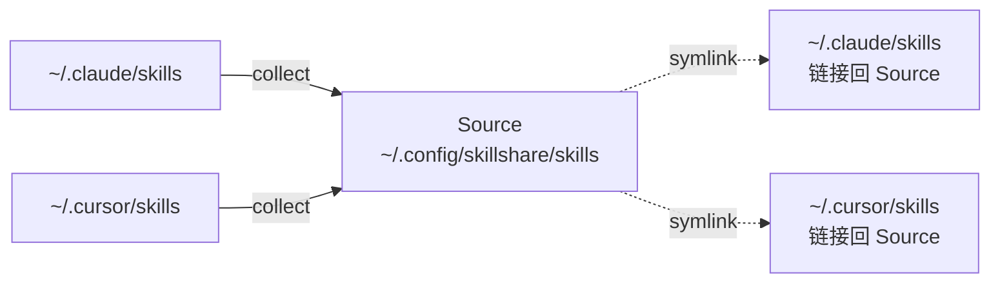

# 从现有 Skills 迁移

你的 skills 零散地分布在 `~/.claude/skills/`、`~/.cursor/skills/` 或其他 AI CLI 目录中。本指南会把它们整合到单一 Source，并用 symlink 替换掉原来的文件。

```text
BEFORE                                  AFTER
─────────────────────────────────────────────────────────────────
~/.claude/skills/                       Source (one source of truth)
  ├── skill-a/                          ~/.config/skillshare/skills/
  └── skill-b/                            ├── skill-a/
                                          ├── skill-b/
~/.cursor/skills/                         ├── skill-c/
  ├── skill-b/  (duplicate!)              └── skill-d/
  └── skill-c/
                                        Targets (symlinked back)
~/.codex/skills/                        ~/.claude/skills/ → source
  └── skill-d/                          ~/.cursor/skills/ → source
                                        ~/.agents/skills/ → source
```

:::caution 请先备份
`collect` 会改动 Target 目录 —— 本地 skills 会被替换成 symlink。请务必在 collect 之前执行 `skillshare backup`，这样万一之后发现不对劲，还能用 `skillshare restore <target>` 撤销。
:::

## 该走哪条路

| 你的情况 | 路径 |
|---|---|
| skills 只在一个 CLI 里 | [单 CLI 迁移](#single-cli-migration) |
| skills 分散在多个 CLI 中 | [多 CLI 整合](#multi-cli-consolidation) |
| 你在别处已经有一个 skills git repo | [接入现有 repo](#connect-an-existing-repo) |

---

## 单 CLI 迁移 {#single-cli-migration}

如果所有 skill 都在同一个 Target 里（比如 Claude），`init --copy-from` 一步就能搞定：

```bash
skillshare init --copy-from claude
skillshare sync
```

`--copy-from claude` 会在 init 期间把 `~/.claude/skills/` 中的每个 skill 复制到 Source。随后的 `sync` 会把原来的文件替换成指回 Source 的 symlink。

---

## 多 CLI 整合 {#multi-cli-consolidation}

skills 分散在多个 Target 中。先初始化为空，做一次快照，然后从每个 Target `collect`。

```bash
# 1. Initialize empty
skillshare init --no-copy

# 2. Snapshot every target before mutating it
skillshare backup

# 3. Collect — once for everything, or per target
skillshare collect --all
#   or:
#   skillshare collect claude
#   skillshare collect cursor

# 4. Sync — targets now symlink back to source
skillshare sync
```

`collect` 对每个 Target 做了什么：

1. 把未被 symlink 的本地 skills 复制进 Source（会跳过 skill 内部的 `.git/`）。
2. 用指回 Source 的 symlink 替换原来的文件。
3. 检测重复（同一个 skill 名出现在多个 Target 中）并报告，不做覆盖。

skills 会被复制进 Source，原来的位置则换成指回去的链接：



### 处理重复

当某个 skill 在 Source 和你正在 collect 的 Target 中都存在时，Target 里的那份会被跳过并报告出来：

```
Warning: skill-b exists in source
  Source:  ~/.config/skillshare/skills/skill-b/
  Skipped: ~/.cursor/skills/skill-b/
```

需要手动处理：对比两份内容，把你想保留的那份放进 Source，然后要么不动 Target 里的版本（下次 `sync` 时它会被 symlink 替换掉），要么在你更想保留 Target 版本时重新执行 `collect --force`。

---

## 接入现有 repo {#connect-an-existing-repo}

如果你在 GitHub 上已经有一个 skills repo（也许是上一台机器留下的），就别用 `collect` —— 直接 clone 它：

```bash
skillshare init --remote git@github.com:you/skills.git --all-targets --no-skill
skillshare sync
```

Tracked 依赖是 gitignored 的，不会随 clone 一起下来。init 之后重新安装它们：

```bash
skillshare install https://github.com/your-company/skills --track --force
skillshare sync
```

---

## 把迁移后的 Source 推到 git

迁移完成后，把 Source 纳入版本控制，这样以后换机器时能用同样的方式恢复。

```bash
# Skip this if you already passed --remote during init.
cd ~/.config/skillshare/skills
git remote add origin git@github.com:you/skills.git

skillshare push -m "Initial commit: migrated skills"
```

从此以后，用 `skillshare push` 和 `skillshare pull` 在机器之间搬运 skills。

---

## 验证

```bash
skillshare status     # every target should report 'synced'
skillshare list       # all collected skills should appear
skillshare doctor     # diagnostics — broken symlinks, missing targets, etc.
```

## 回滚

因为你事先执行了 `backup`，所以 `collect` 是可逆的：

```bash
skillshare restore claude
skillshare restore cursor
```

每个 Target 都会回到 collect 之前的状态 —— 真实文件，没有 symlink。

---

## 另见

- [日常工作流](/docs/how-to/daily-tasks/daily-workflow) —— 迁移之后的日常使用
- [跨机器 Sync](/docs/how-to/sharing/cross-machine-sync) —— 通过 git 同步
- [核心概念](/docs/understand) —— Source 与 Targets 的关系
