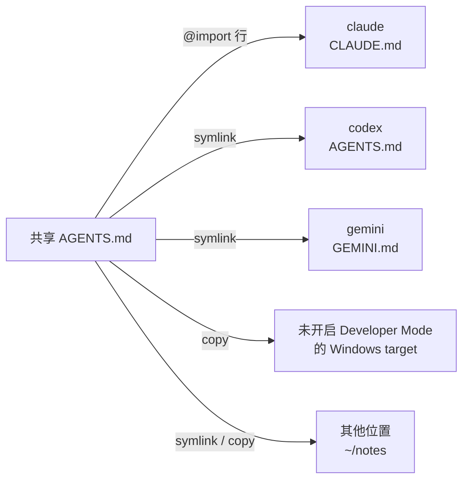

# 让多个工具共用一份 AGENTS.md

每个 AI 工具都从自己的文件读取常驻指令。Claude Code 读取 `CLAUDE.md`，Gemini CLI
读取 `GEMINI.md`，Codex 和大多数其他工具读取 `AGENTS.md`，各自放在自己的文件夹中。
网页控制台（`skillshare ui`）会显示这些文件，让你编辑它们，还能让多个工具共用一份
`AGENTS.md`。

这是控制台功能，没有单独的 CLI 命令。共享 `AGENTS.md` 以
[extra](../../reference/commands/extras.md#single-file-extras) 的形式存储，因此
`skillshare sync extras` 也会让它保持就位。

## 查看 target 读取什么 {#see-what-a-target-reads}

在 **目标** 中打开一个 target。它的页面有一个以该 target 读取的文件命名的标签页：
claude 是 **CLAUDE.md**，gemini 是 **GEMINI.md**，codex 是 **AGENTS.md**。
这个标签页从上到下显示：

- 文件的路径和大小，以及 **更改位置**（[见下文](#change-which-file-a-target-reads)）、
  **转换…** 和 **保存**。
- 一行 **读取顺序**：该工具加载的文件，按加载顺序排列，每个都标记是否已加载（鼠标悬停可
  看到 `loaded`、`skipped` 或 `missing`）。对 claude 来说，这包括 `~/.claude/rules/` 中的
  Markdown 文件（该文件夹里有文件时才会列出，空的 rules 文件夹不会列出），以及一条说明 claude 不读取用户级 `AGENTS.md` 的提示。在 global mode 下，
  这一行的末尾还有 **共享 AGENTS.md**：这个 target 使用的共享文件，以及选择它们的链接。
- 该文件的编辑器，带有 **编辑** 和 **预览** 两个标签页；**预览** 会渲染 Markdown，包括尚未保存的修改。
  长行会自动换行。**保存**（或 ⌘S / Ctrl+S）会先备份当前文件；如果文件还不存在，则会创建它。以 `@` 开头的
  行是 import，只有部分工具会展开它们；其他工具会把它们当作纯文本读取。编辑器会给这些行
  着色，并附上一条简短说明，指出哪个工具会展开它们。
- 警告。Windsurf 只读取其全局 rules 文件的前 6,000 个字符。


如果该文件是指向共享 `AGENTS.md` 的链接，编辑器就是只读的。编辑它会改变所有使用该共享
文件的 target，所以请改到那份文件自己的页面上编辑。你自己建立的链接（例如指向你的
dotfiles 的链接）仍然可以编辑，保存时会写入它所指向的文件。

skillshare 知道以下指示文件：

| Target | 用户级文件 | 项目文件 | 会展开 `@` import |
|--------|-----------------|--------------|---------------------|
| amp | `~/.config/amp/AGENTS.md` | `AGENTS.md` | 否 |
| antigravity | `~/.gemini/GEMINI.md`（与 gemini 是同一个文件） | `AGENTS.md` | 否 |
| antigravity-cli | `~/.gemini/GEMINI.md`（与 gemini 是同一个文件） | `AGENTS.md` | 否 |
| claude | `~/.claude/CLAUDE.md`，以及 `~/.claude/rules/` | `CLAUDE.md`，没有 `CLAUDE.md` 时则为 `AGENTS.md`，以及 `.claude/rules/` | 是 |
| cline | `~/.agents/AGENTS.md`（与 universal 是同一个文件），以及 `~/Documents/Cline/Rules/` | `AGENTS.md`，以及 `.clinerules/` | 否 |
| codebuddy | `~/.codebuddy/CODEBUDDY.md`，以及 `~/.codebuddy/rules/` | `CODEBUDDY.md`，没有 `CODEBUDDY.md` 时则为 `AGENTS.md`，以及 `.codebuddy/rules/` | 是 |
| codex | `~/.codex/AGENTS.md` | `AGENTS.md` | 否 |
| commandcode | `~/.commandcode/AGENTS.md` | `AGENTS.md` | 是 |
| copilot | `~/.copilot/copilot-instructions.md` | `.github/copilot-instructions.md` | 否 |
| cursor | 无：User Rules 存在 Cursor 的设置里 | `AGENTS.md` | 否 |
| deepagents | `~/.deepagents/agent/AGENTS.md` | `.deepagents/AGENTS.md` | 否 |
| devin | `~/.config/devin/AGENTS.md` | `AGENTS.md` | 否 |
| droid | `~/.factory/AGENTS.md` | `AGENTS.md` | 否 |
| firebender | `~/.firebender/AGENTS.md` | `AGENTS.md` | 否 |
| forgecode | `~/forge/AGENTS.md` | `AGENTS.md` | 否 |
| gemini | `~/.gemini/GEMINI.md` | `GEMINI.md` | 否 |
| goose | `~/.config/goose/.goosehints` | `AGENTS.md` | 否 |
| grok | `~/.grok/AGENTS.md`，以及 `~/.grok/rules/` | `AGENTS.md`，以及 `.grok/rules/` | 否 |
| iflow | `~/.iflow/IFLOW.md` | `IFLOW.md` | 是 |
| junie | `~/.junie/AGENTS.md` | `AGENTS.md` | 否 |
| kiro | `~/.kiro/steering/AGENTS.md` | `AGENTS.md` | 否 |
| omp | `~/.omp/agent/AGENTS.md` | `AGENTS.md` | 是 |
| opencode | `~/.config/opencode/AGENTS.md` | `AGENTS.md` | 否 |
| pi | `~/.pi/agent/AGENTS.md` | `AGENTS.md` | 否 |
| pochi | `~/.pochi/README.pochi.md` | `AGENTS.md` | 否 |
| qoder | `~/.qoder/AGENTS.md`，以及 `~/.qoder/rules/` | `AGENTS.md`，以及 `.qoder/rules/` | 是 |
| qwen | `~/.qwen/QWEN.md` | `QWEN.md` | 是 |
| roo | `~/.roo/rules/AGENTS.md` | `AGENTS.md` | 否 |
| rovodev | `~/.rovodev/AGENTS.md` | `AGENTS.md` | 否 |
| universal | `~/.agents/AGENTS.md` | `AGENTS.md` | 否 |
| verdent | `~/.verdent/VERDENT.md` | `AGENTS.md` | 否 |
| vibe | `~/.vibe/AGENTS.md` | `AGENTS.md` | 否 |
| warp | `~/.agents/AGENTS.md`（与 universal 是同一个文件） | `AGENTS.md` | 否 |
| windsurf | `~/.codeium/windsurf/memories/global_rules.md`（前 6,000 个字符） | `AGENTS.md` | 否 |
| zed | `~/.config/zed/AGENTS.md` | `AGENTS.md` | 否 |

Claude、Codex 或 Pi 的[第二个账号](../../reference/targets/configuration.md#agent-config-dir)
读取的是其自身配置目录中的同一个文件，例如 `~/.claude-work/CLAUDE.md`。对于其他
target，你可以[告诉 skillshare 它读取哪个文件](#tools-skillshare-doesnt-know)。

## 通过 universal 读取 skills 的工具 {#tools-that-read-skills-through-universal}

很多工具会从 universal target 的文件夹 `~/.agents/skills` 读取 skills。Codex 和 Goose 把它当作自己的
skills 文件夹，Gemini CLI、Pi、OpenCode 等工具则是除了自己的文件夹外也会读取它。如果你通过 universal
把 skills 同步给它们，而没有把它们添加为 target，它们读取的仍是自己的指令文件，而不是
`~/.agents/AGENTS.md`：例如 Codex 读取 `~/.codex/AGENTS.md`，Gemini CLI 读取 `~/.gemini/GEMINI.md`。

在 global 模式下，universal 的 **AGENTS.md** 标签页会在左侧列出它管理的文件：先是 universal 自己的文件，
再是已安装的这类工具；skillshare 以它们的文件夹（例如 `~/.codex` 或 `~/.gemini`）是否存在来判断。
每一行都会显示该文件是否已存在。选择其中一个即可查看并编辑
它自己的文件，选择会以 `?tool=<name>` 记录在 URL 中。它们也会出现在 **Extras** 的共享 AGENTS.md 列表中，
因此可以为它们连接共享文件。它们的文件位置无法修改，因为它们没有 target 配置可以保存这个值。没有列出的
工具，可以把它添加为独立的 target。

有些工具会读取 `~/.agents/AGENTS.md` 本身，例如 Cline 和 Warp Agent CLI。Codex、Gemini CLI 和 Pi
读取的是自己的文件。

## 将 CLAUDE.md 转换为 AGENTS.md {#convert-claudemd-to-agentsmd}

在 target 的标签页上点击 **转换…**，让它的内容也能被其他工具读取。当文件有可移动的
内容、且本身还不是 `AGENTS.md` 时，这个按钮才会出现。对话框会在写入任何内容之前预览
所有变更，被它修改或移除的每个文件都会先备份。

| 方式 | 结果 | 适用 |
|--------|--------|-----------|
| **移到 AGENTS.md，CLAUDE.md 改为导入它**（推荐） | 内容移到 `AGENTS.md`。`CLAUDE.md` 只保留一行 `@AGENTS.md` 以及只有 claude 能理解的行 | 会展开 `@` import 的工具（claude） |
| **将 CLAUDE.md 重命名为 AGENTS.md** | `CLAUDE.md` 被移除，claude 改为读取 `AGENTS.md` | 仅限项目，且工具在自己的文件不存在时会读取 `AGENTS.md`。存在 `CLAUDE.local.md` 时，或 `CLAUDE.md` 正在使用共享 `AGENTS.md` 时会被拒绝（下次 sync 会把 `CLAUDE.md` 重新建出来） |
| **复制为 AGENTS.md** | 两个文件都保留并各自编辑，之后内容会逐渐不一致 | 始终可用 |

文件名随 target 而定：对于 gemini，对话框只提供 **复制为 AGENTS.md**。使用第一种方式时，
**将 … 行 @import 保留在 CLAUDE.md** 默认开启，因为其他工具会把这些行当作纯文本读取。

在用户级，没有其他工具会读取 `~/.claude` 中的 `AGENTS.md`。因此在 global mode 下，
第一种方式还提供 **转换为共享 AGENTS.md，让其他目标也能接**，默认开启：

- **新建一份…**：为新的共享 `AGENTS.md` 命名；名称默认是该 target 的名称，例如 `claude`。内容会移进去，`CLAUDE.md` 改为导入它。
- 已有的共享文件：内容会接在该文件的最后面，`CLAUDE.md` 随后导入它。

关闭共享时，内容会移到 `~/.claude/AGENTS.md`，`CLAUDE.md` 则得到一行 `@AGENTS.md`。

没有其他可选的共享文件时，**Convert…** 只要求输入新名称；有其他文件可选时才会显示共享文件选择器。

## 在 global mode 下共享一份 AGENTS.md {#share-one-agentsmd-in-global-mode}

前往 **Extras** 并打开 **AGENTS.md** 标签页。**新建共享 AGENTS.md** 会要求输入名称
（英文字母、数字、`-` 和 `_`）以及起始内容：

- **空白文件**：在对话框中编写第一版内容。
- **把 claude 的文件移进来**（或任何其他有文件、且尚未使用共享文件的 target）：该 target
  当前的文件会移进这份共享文件，之后该 target 就改用共享文件。原文件会先备份。

每份共享文件存储在 `<extras source>/<name>/AGENTS.md`，默认为
`~/.config/skillshare/extras/<name>/AGENTS.md`。

target 如何使用共享文件，取决于它是否会展开 `@` import：

- **Import target**（claude，以及你标记为支持 `@import` 的工具）保留自己的内容，并且可以
  同时使用多份共享文件。skillshare 会在文件顶部的受管区块中为每份共享文件加入一行，
  从不改动区块以外的任何内容。Claude 没有用户级的 `AGENTS.md`，所以它是通过这个区块
  读取共享文件的：

  ```markdown title="~/.claude/CLAUDE.md"
  <!-- skillshare:instructions:begin -->
  @/Users/you/.config/skillshare/extras/personal/AGENTS.md
  <!-- skillshare:instructions:end -->

  Your own Claude-only instructions stay here.
  ```

- **其他 target**（codex、gemini 等）使用一份共享文件。它们的文件会先备份，然后被替换为
  指向共享文件的链接（symlink）。在未开启 Developer Mode 的 Windows 上无法使用文件链接，
  因此会改为替换成一份副本。

在全局模式下，一份共享文件会这样送到各个 target：



标签页左侧列出共享文件，每份都附上连接到它的 target。点击其中一份，右侧就会显示它的路径、
内容（默认显示渲染后的 **预览**，可切换到 **源代码** 查看原始文本），以及每个 target 和对应的开关。选中的文件会写进 URL
（`/extras?tab=instructions&file=<name>`），因此通过链接可以直接打开那份文件。

- 打开某个 target 的开关即可连接它。import target 会多一行 import，并保留它的其他共享文件。
  已经在使用另一份共享文件的 target 会先询问，因为它只能使用一份。
- 关闭开关会[还原](#restore-and-delete)该 target，并且会先显示结果的预览。对于 import
  target，只会去掉这份文件的 import 行，其他共享文件保留。
- **全部连接** 和 **全部还原** 在执行任何操作之前，会列出所有将被修改的 target，并说明每个
  target 会发生什么。只想修改部分 target 时，勾选它们的行，然后使用选择栏中的 **连接** 或
  **还原**。

有几个 target 比较特殊：

- antigravity 与 gemini 读取同一个 `~/.gemini/GEMINI.md`。当两者都是 target 时，antigravity
  的行会跟随 gemini，不能单独修改。
- cline 和 warp 与 universal 读取同一个 `~/.agents/AGENTS.md`。当 universal 也是 target 时，
  它们的行会跟随 universal。
- cursor 不会出现在列表中：它的 User Rules 存在 Cursor 的设置里，而不是文件中。

使用链接或 `copy` 的 target 文件只能属于一份共享文件，不能同时 import 另一份。**全部连接** 会跳过已被其他共享文件占用的 target，包括自行创建的链接；请先还原原有连接，再接上另一份文件。

## 管理一份共享文件 {#manage-one-shared-file}

每个已连接的 target 都有一个 mode 选择器，并显示它的状态。mode 决定 target 如何获得共享
文件：

| Mode | Target 文件 | 可用范围 |
|------|-------------|-----------|
| `import` | 你自己的文件，受管区块中有一行 `@import`。对共享文件的修改立即生效 | 会展开 `@` import 的 target |
| `symlink` | 指向共享文件的链接。修改立即生效 | 未开启 Developer Mode 的 Windows 上不可用 |
| `copy` | 共享文件的副本。在控制台中保存共享文件会更新副本；在其他地方编辑共享文件后，请在这个页面点 **Sync** 再同步一次 | 始终可用 |


无法使用文件链接时，**Targets** 旁的信息提示会说明 Windows Developer Mode。指令文件的警告和错误会使用控制台语言；未知代码则显示原始英文消息。

选择器会标出默认值：会展开 `@` import 的 target 为 `import`，其他为 `symlink`，在未开启
Developer Mode 的 Windows 上则为 `copy`。使用多份共享文件的 target 只能使用 `import`。
更改 mode 会立即 sync 该 target。切回 `import` 时，会放回上次在 `import` mode 的自有内容（若未用过则使用连接前的内容），再加上 import 区块。

在 Windows 上，如果 target 的文件是一个被建成文件夹的链接，就会显示警告：工具读不到它。
把它切换为 `copy`（或运行 `skillshare sync extras`）即可修复；参见
[Windows 疑难解答](../../troubleshooting/windows.md#agent-files-or-agentsmd-show-a-folder-icon-and-cant-be-read)。

切换 mode 若替换了修改内容，dashboard 会显示备份提示。切回 `import` 时会保留最后保存的自有内容，包括有意清空的文件。

| 状态 | 含义 |
|--------|---------|
| `synced` | 链接、副本或 import 行已就位 |
| `modified` | 链接被替换为内容不同的普通文件，或受管理的副本被修改 ([见下文](#when-a-linked-file-is-edited)) |
| `drift` | target 文件存在，但没有链接到共享文件，或不再有 import 行 |
| `not synced` | target 文件还不存在 |
| `no source` | 共享文件本身不存在 |

如果 target 文件路径被文件夹占用，请先删除或重命名该文件夹，再同步；同步不会替换它。

当有已连接的 target 处于 `drift` 或 `not synced` 时，标题会显示有多少个需要 sync，并提供
**同步** 按钮，把这份文件的链接、副本和 import 行放回原位。

**编辑** 会在大尺寸编辑器中打开文件，带有 **编辑** 和 **预览** 两个标签页。侧边栏列出保存后会立即读到这份文件的 target，并对只
读取长文件前一部分的 target 给出警告。按 ⌘S（Ctrl+S）保存。上一个版本会被备份，`copy` 模式的 target 也会获得新内容；保存后的提示会列出这些 target。

**⋯** 菜单可以复制文件路径，或删除这份共享文件。

### 还原与删除 {#restore-and-delete}

还原 target 会让它回到接上共享文件之前的状态。原本的文件或 symlink 会被放回；如果原本
没有文件，则删除该文件。

关闭 target 的开关时，会先显示还原将做什么：

- 默认显示还原后文件的内容，另有一个标签页显示与当前文件的差异。
- 如果原本没有文件，会提示还原将删除该文件。
- 如果原本是链接，会显示将放回的链接。
- 如果你在接上之后编辑过该文件，会提示这些编辑不会被还原；它们会保留为
  [drift 备份](#backups)。
对于 import target，只会移除 skillshare 的 import 行；skillshare
仅为该区块而创建的 `CLAUDE.md`，在变空后会被删除。共享文件本身会保留。如果 target 仍处于
`modified`，编辑过的文件会先保留为 [drift 备份](#backups)。

删除共享文件会将它从配置中移除，并还原所有使用它的 target。文件本身会保留在 extras
文件夹中。

在 Windows 上，原本的 junction 会还原为 junction，不需要 Developer Mode 或管理员权限。

替换你自己创建的 junction 时，警告会列出它原本指向的位置。

## 其他位置 {#other-locations}

**其他位置** 位于 target 下方，列出共享文件写入、但不属于列表中任何工具的地方：不是 target 的文件夹
（例如笔记或 dotfiles repo），或不同的文件名（例如 `instructions.md`）。效果等同
`skillshare extras <name> --add-target <dir> --as <file>`，用这个命令添加的位置也会显示在这里。

**添加位置** 会要求输入：

- **文件夹**：完整路径，或以 `~` 开头的路径。不存在时会自动创建。
- **文件名**：留空则使用共享文件的名称 `AGENTS.md`。
- 这个位置获取文件的方式：`symlink`（默认）、`copy` 或 `import`。必须先勾选读取这个文件的工具支持
  `@import`，才能选择 `import`；不支持的工具只会看到一行路径。Windows 未开启 Developer Mode 时无法使用
  `symlink`，默认改为 `copy`。

**添加并同步** 会立即写入文件；无法写入时不会保存任何配置。以下情况 skillshare 会拒绝添加：

- 该文件路径被文件夹占用。请换一个文件名，或先移走该文件夹。
- 该文件是列表中某个工具自己的 instruction 文件。请改为在 **目标** 中开启那个工具。
- 该文件已经链接或复制了另一份共享文件。请先从那份共享文件中移除它，或两边都使用 `import`。
- 这个文件夹已经是这份共享文件的位置。请在那一行更改模式。

每一行显示文件、模式选择器和[状态](#manage-one-shared-file)。更改模式会立即同步该位置。
处于 `drift` 或 `not synced` 的位置会计入标题的 **同步** 按钮。**移除** 会先显示
[还原预览](#restore-and-delete)；**移除并还原** 会放回文件原来的内容，并把该位置从列表中移除。
`modified` 的位置和 target 行一样有两个按钮，可以收回修改或覆盖它（[见下文](#when-a-linked-file-is-edited)）。

在项目中，位置的工作方式相同；请参阅[项目中的共享文件](#shared-files-in-a-project)。

## 当链接的文件被编辑时 {#when-a-linked-file-is-edited}

如果你或某个工具直接编辑了 target 的文件，链接被替换为内容不同的普通文件，其状态就会
变为 `modified`，该行会显示一条提示，提供两个选择：

- **收进**共享文件：修改写回共享文件，所有使用它的 target 都会获得这些修改。当前的共享
  文件会先备份。
- **用**共享文件**覆盖**：编辑过的文件会保留为 [drift 备份](#backups)，链接恢复。其他
  target 不受影响。

无论哪种方式，之后的还原仍会让 target 回到使用共享文件之前的状态，而不是编辑后的
版本。

`skillshare sync extras` 和 **同步** 也会不经询问地对 `modified` 的文件重新应用所选 mode。修改会先
保留为 drift 备份，所以如果共享文件应该获得这些修改，请在同步之前选择 **收进**。

受管理的 `copy` 被修改后也会显示 `modified`，并提供相同的 **收进** 与 **覆盖** 选项。覆盖或同步会重新应用所选 mode，因此 `copy` target 仍保持副本。

## 更改 target 读取的文件 {#change-which-file-a-target-reads}

target 标签页上的 **更改位置** 会打开一个对话框，你可以在其中更改 target 读取的路径和
文件名，例如用 `~/.claude/instructions.md` 代替 `~/.claude/CLAUDE.md`。如果该工具会展开
`@` 行，请勾选 **这个工具支持 @import**。该设置会以
[`instructions`](../../reference/targets/configuration.md#target-instructions) 保存在 target 上。
**恢复默认** 会回到 skillshare 为该 target 所知的文件。

当 target 正在使用共享文件时，skillshare 会拒绝更改位置；请先把它切回自己的文件。在
universal 标签页上列出的工具没有 target 配置，因此无法更改它们的位置。

路径必须指向文件；现有目录会被拒绝。接上共享文件时，**更改位置** 会禁用。

## skillshare 不认识的工具 {#tools-skillshare-doesnt-know}

对于没有已知指示文件的 target（例如
[自定义 target](../../reference/targets/adding-custom-targets.md)），标签页会询问
**这个工具读哪个文件**：

- 在 global mode 下，输入完整路径或以 `~/` 开头的路径。
- 在项目中，输入相对于项目根目录的路径。

如果该工具会展开 `@` 行，请勾选 **这个工具支持 @import**。这样它就能像 claude 一样同时
使用多份共享文件。该设置会以
[`instructions`](../../reference/targets/configuration.md#target-instructions) 保存在 target 上。添加工具时，也可以直接在 **添加目标** → **自定义目标** 中填写。

之后可以使用 **更改位置** 来更新它；对话框中也有 **移除设置**。移除设置不会删除文件。
当 target 正在使用共享文件时，skillshare 会拒绝更改或移除该位置；请先把它切回自己的文件。

## 项目 {#projects}

在项目中运行 `skillshare ui -p`。在项目中，每个 target 都读取随 repo 纳入版本控制的同一个
`./AGENTS.md`，因此没有什么需要共享或 sync。**Extras** 下的 **AGENTS.md** 标签页会创建或
编辑该文件，并显示每个 target 能否读取它：

| 读取方式 | 含义 |
|-------------------|---------|
| 直接读取 | 该工具的项目文件就是 `AGENTS.md` |
| 没有 CLAUDE.md，所以会读取 AGENTS.md | claude 回退到读取 `AGENTS.md` |
| CLAUDE.md 导入了它 | 该工具自己的文件中有一行 `@AGENTS.md` |
| GEMINI.md 链接到它 | 该工具自己的文件是指向 `AGENTS.md` 的 symlink |
| 已有 CLAUDE.md，所以 claude 不会读取 AGENTS.md | 该工具自己的文件遮住了 `AGENTS.md` |
| 默认只读取 GEMINI.md | 该工具读取自己的文件，而该文件不存在 |

只读取自己文件的工具可以一键修正：**添加 @AGENTS.md** 会在 `CLAUDE.md` 顶部加入 import 行
（先备份），**添加 GEMINI.md** 会创建指向 `AGENTS.md` 的链接 `GEMINI.md`。

一个项目只有一份 `AGENTS.md`，因此无法分组。要把个人和工作的指令分开，请在 global mode
下使用共享文件。

target 标签页在项目中同样可用。此时读取顺序显示的是项目文件，而 **转换…** 还会为 claude
提供 **重命名**。

project mode 的 import 使用相对于 target 文件的路径，因此移动 repository 后仍可使用。

### 项目中的共享文件 {#shared-files-in-a-project}

要把同一份文件放到 repository 中的多个位置，例如 `./.gemini/GEMINI.md` 和 `./docs/ai/instructions.md`，
请使用标签页底部的 **共享文件**。共享文件是单文件 extra：它唯一的一份存放在 `.skillshare/extras/<name>/`，
并随项目一起 commit。**新建共享文件** 会创建它，每张卡片列出它的位置，并提供与
[其他位置](#other-locations)相同的 **添加位置**、模式选择器、状态和 **移除**。在项目中的区别：

- **文件夹** 是相对于项目根目录的路径；根目录本身用 `.`。项目之外的路径，例如 `../notes` 或 `~/notes`，
  会被拒绝。
- 可以使用工具自己的文件，例如以 `import` 方式使用 `./CLAUDE.md`。
- 链接和 import 使用相对路径，因此 clone 下来的 repository 仍可正常使用。

单文件 extras 只会出现在这里，不会出现在 **文件夹** 标签页。卡片菜单中的 **删除** 会先还原所有位置，
再将该 extra 从配置中移除；`.skillshare/extras/` 中的文件会保留。

## 备份 {#backups}

skillshare 在替换、移除文件，或修改你写的内容之前，都会先备份该文件。添加或移除它自己的
import 行则不需要备份。每个文件最近的 10 个版本保存在 skillshare 的 state 目录中，在
macOS 和 Linux 上位于 `~/.local/state/skillshare/extras/backups/`（设置了
`$XDG_STATE_HOME` 时为 `$XDG_STATE_HOME/skillshare/extras/backups/`）。

还原使用的是接上共享文件时原本存在的内容，而不是最新的备份。被同步、覆盖或还原替换
掉的修改会进入单独的 `drift/` 文件夹，即 `extras/backups/<id>/drift/`，其中 `<id>` 由
target 文件的路径推导而来。还原从不会把这些放回去。

要查看或放回任何一个版本，请在 dashboard 中打开 **设置 › 备份 › 文件**，或使用
[`skillshare backup files`](../../reference/commands/backup.md#file-history)。
每个版本都会显示保存的原因，例如转换为 `AGENTS.md` 或覆盖，而 **预览并还原**
会先把它与当前文件进行比较。

关于共享文件背后的配置，以及同样能处理它们的 CLI 命令，请参见
[单文件 extras](../../reference/commands/extras.md#single-file-extras)。
