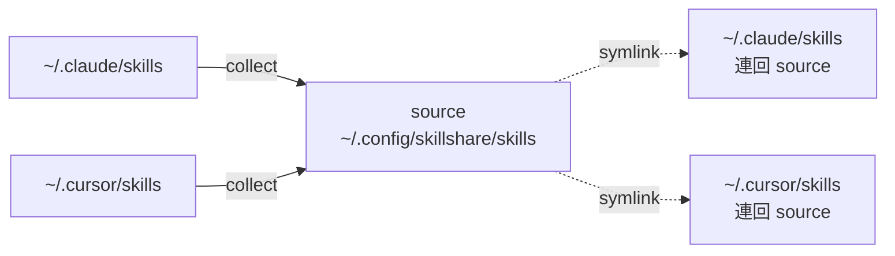

# 從既有 Skills 遷移

你的 skills 目前散落在 `~/.claude/skills/`、`~/.cursor/skills/` 或其他 AI CLI 目錄中。這份指南會把它們整併到單一 source，並把原本的檔案換成 symlink。

```text
BEFORE                                  AFTER
─────────────────────────────────────────────────────────────────
~/.claude/skills/                       Source (one source of truth)
  ├── skill-a/                          ~/.config/skillshare/skills/
  └── skill-b/                            ├── skill-a/
                                          ├── skill-b/
~/.cursor/skills/                         ├── skill-c/
  ├── skill-b/  (duplicate!)              └── skill-d/
  └── skill-c/
                                        Targets (symlinked back)
~/.codex/skills/                        ~/.claude/skills/ → source
  └── skill-d/                          ~/.cursor/skills/ → source
                                        ~/.agents/skills/ → source
```

:::caution 請先備份
`collect` 會變更 target 目錄 — 本機 skills 會被換成 symlink。請務必先執行 `skillshare backup` 再 collect，這樣萬一事後發現不對勁，`skillshare restore <target>` 才能復原。
:::

## 你屬於哪一種情況

| 你的情況 | 路線 |
|---|---|
| Skills 只存在單一 CLI 中 | [單一 CLI 遷移](#single-cli-migration) |
| Skills 分散在多個 CLI 中 | [多 CLI 整併](#multi-cli-consolidation) |
| 你已經有一個 skills git repo 在別處 | [接上既有的 repo](#connect-an-existing-repo) |

---

## 單一 CLI 遷移 {#single-cli-migration}

如果所有 skills 都在同一個 target 裡（例如 Claude），`init --copy-from` 一步就能搞定：

```bash
skillshare init --copy-from claude
skillshare sync
```

`--copy-from claude` 會在 init 期間把 `~/.claude/skills/` 裡的每個 skill 複製進 source。接著的 `sync` 會把原本的檔案換成指回 source 的 symlink。

---

## 多 CLI 整併 {#multi-cli-consolidation}

Skills 分散在多個 targets 中。先初始化成空的，建立快照，再從每個 target `collect`。

```bash
# 1. 初始化成空的
skillshare init --no-copy

# 2. 在變更之前先為每個 target 建立快照
skillshare backup

# 3. Collect — 一次全部，或逐一 target
skillshare collect --all
#   或：
#   skillshare collect claude
#   skillshare collect cursor

# 4. Sync — targets 現在會 symlink 回 source
skillshare sync
```

`collect` 對每個 target 做的事：

1. 把非 symlink 的本機 skills 複製進 source（會略過 skill 內部的任何 `.git/`）。
2. 把原本的檔案換成指回 source 的 symlink。
3. 偵測重複項目（同一個 skill 名稱出現在多個 target），並回報而不覆寫。

Skills 會被複製進 source，原本的位置則換成指回去的連結：



### 處理重複項目

當某個 skill 同時存在於 source 和你正在 collect 的 target 中，target 版本會被略過並回報：

```
Warning: skill-b exists in source
  Source:  ~/.config/skillshare/skills/skill-b/
  Skipped: ~/.cursor/skills/skill-b/
```

請手動處理：比對兩份副本的差異，把你要的那份保留在 source，接著要嘛不動 target 版本（下次 `sync` 時會被 symlink 取代），要嘛在你比較想保留 target 版本時重新執行 `collect --force`。

---

## 接上既有的 repo {#connect-an-existing-repo}

如果你在 GitHub 上已經有一個 skills repo（也許來自前一台機器），就別用 `collect` — 直接 clone 下來：

```bash
skillshare init --remote git@github.com:you/skills.git --all-targets --no-skill
skillshare sync
```

Tracked 相依項目已被 gitignore，不會跟著 clone 下來。init 之後重新安裝它們：

```bash
skillshare install https://github.com/your-company/skills --track --force
skillshare sync
```

---

## 把遷移後的 source 推上 git

遷移完成後，把 source 納入版本控管，未來的機器才能用同樣方式復原。

```bash
# 如果 init 時已經帶過 --remote，這步可略過。
cd ~/.config/skillshare/skills
git remote add origin git@github.com:you/skills.git

skillshare push -m "Initial commit: migrated skills"
```

從此以後，`skillshare push` 與 `skillshare pull` 就能在機器之間搬移 skills。

---

## 驗證

```bash
skillshare status     # 每個 target 都應回報 'synced'
skillshare list       # 所有 collect 進來的 skills 都應出現
skillshare doctor     # 診斷 — 失效的 symlink、缺少的 targets 等
```

## 回復

因為你事先跑過 `backup`，所以 `collect` 是可以回復的：

```bash
skillshare restore claude
skillshare restore cursor
```

每個 target 都會回到 collect 之前的狀態 — 實體檔案，沒有 symlink。

---

## 延伸閱讀

- [日常工作流程](/docs/how-to/daily-tasks/daily-workflow) — 遷移後的日常使用
- [跨機器同步](/docs/how-to/sharing/cross-machine-sync) — 透過 git 同步
- [核心概念](/docs/understand) — source 與 targets 的關係
