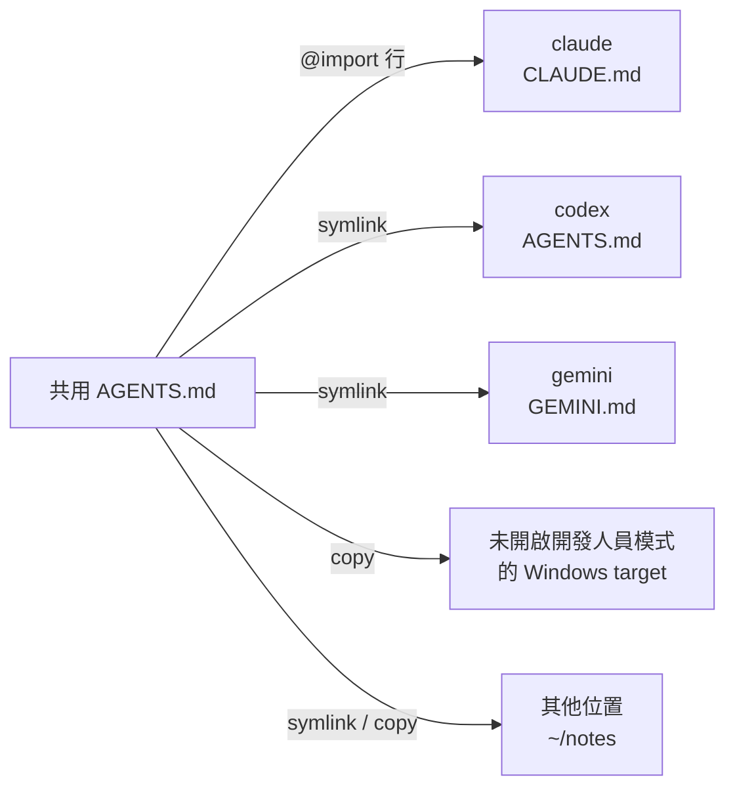

# 讓多個工具共用一份 AGENTS.md

每個 AI 工具都從自己的檔案讀取常設指示。Claude Code 讀 `CLAUDE.md`，Gemini CLI 讀
`GEMINI.md`，Codex 與大多數其他工具則讀 `AGENTS.md`，而且各自放在自己的資料夾裡。網頁
dashboard（`skillshare ui`）會顯示這些檔案、讓你編輯它們，也能讓多個工具共用同一份 `AGENTS.md`。

這是 dashboard 的功能，沒有獨立的 CLI 指令。共用 `AGENTS.md` 是以
[extra](../../reference/commands/extras.md#single-file-extras) 的形式儲存，所以
`skillshare sync extras` 也會讓它維持在正確位置。

## 查看 target 讀哪些檔案 {#see-what-a-target-reads}

從 **Targets** 開啟一個 target。它的頁面有一個以該 target 所讀檔案命名的分頁：claude 是
**CLAUDE.md**，gemini 是 **GEMINI.md**，codex 是 **AGENTS.md**。這個分頁由上到下會顯示：

- 檔案的路徑與大小，以及 **變更位置**（[見下方](#change-which-file-a-target-reads)）、
  **轉換…** 與 **儲存**。
- 一行 **讀取順序**：工具會載入的檔案，依載入順序排列，每個都標示是否已載入（滑鼠移上去可以看到
  `loaded`、`skipped` 或 `missing`）。claude 的讀取順序會在 `~/.claude/rules/` 有檔案時包含其中的 Markdown 檔案（空的 rules 資料夾不會列出），
  並註明 claude 不讀使用者層級的 `AGENTS.md`。在 global mode 中，同一行的最後是
  **共用 AGENTS.md**：這個 target 使用的共用檔案，以及一個用來選擇它們的連結。
- 該檔案的編輯器，有 **編輯** 與 **預覽** 兩個分頁；**預覽** 會渲染 Markdown，包含尚未儲存的修改。
  過長的行會自動換行。**儲存**（或 ⌘S / Ctrl+S）會先備份目前的檔案；若檔案還不存在，則會建立它。以 `@` 開頭的行是
  import，只有部分工具會展開它們；其他工具會把它們當成一般文字讀取。編輯器會替這些行上色，並加上
  一段簡短說明，註明哪個工具會展開它們。
- 警告。Windsurf 只會讀取其全域 rules 檔案的前 6,000 個字元。


如果檔案是指向共用 `AGENTS.md` 的連結，編輯器會是唯讀的。編輯它會改到所有使用該共用檔案的
target，所以請改到該檔案自己的頁面編輯。你自己建立的連結（例如指向你的 dotfiles）仍然可以編輯，
儲存時會寫入它所指向的檔案。

skillshare 知道這些指示檔案：

| Target | 使用者層級的檔案 | 專案檔案 | 會展開 `@` import |
|--------|-----------------|--------------|---------------------|
| amp | `~/.config/amp/AGENTS.md` | `AGENTS.md` | 否 |
| antigravity | `~/.gemini/GEMINI.md`（與 gemini 是同一個檔案） | `AGENTS.md` | 否 |
| antigravity-cli | `~/.gemini/GEMINI.md`（與 gemini 是同一個檔案） | `AGENTS.md` | 否 |
| claude | `~/.claude/CLAUDE.md`，加上 `~/.claude/rules/` | `CLAUDE.md`，沒有 `CLAUDE.md` 時則為 `AGENTS.md`，加上 `.claude/rules/` | 是 |
| cline | `~/.agents/AGENTS.md`（與 universal 是同一個檔案），加上 `~/Documents/Cline/Rules/` | `AGENTS.md`，加上 `.clinerules/` | 否 |
| codebuddy | `~/.codebuddy/CODEBUDDY.md`，加上 `~/.codebuddy/rules/` | `CODEBUDDY.md`，沒有 `CODEBUDDY.md` 時則為 `AGENTS.md`，加上 `.codebuddy/rules/` | 是 |
| codex | `~/.codex/AGENTS.md` | `AGENTS.md` | 否 |
| commandcode | `~/.commandcode/AGENTS.md` | `AGENTS.md` | 是 |
| copilot | `~/.copilot/copilot-instructions.md` | `.github/copilot-instructions.md` | 否 |
| cursor | 無：User Rules 存在 Cursor 的設定裡 | `AGENTS.md` | 否 |
| deepagents | `~/.deepagents/agent/AGENTS.md` | `.deepagents/AGENTS.md` | 否 |
| devin | `~/.config/devin/AGENTS.md` | `AGENTS.md` | 否 |
| droid | `~/.factory/AGENTS.md` | `AGENTS.md` | 否 |
| firebender | `~/.firebender/AGENTS.md` | `AGENTS.md` | 否 |
| forgecode | `~/forge/AGENTS.md` | `AGENTS.md` | 否 |
| gemini | `~/.gemini/GEMINI.md` | `GEMINI.md` | 否 |
| goose | `~/.config/goose/.goosehints` | `AGENTS.md` | 否 |
| grok | `~/.grok/AGENTS.md`，加上 `~/.grok/rules/` | `AGENTS.md`，加上 `.grok/rules/` | 否 |
| iflow | `~/.iflow/IFLOW.md` | `IFLOW.md` | 是 |
| junie | `~/.junie/AGENTS.md` | `AGENTS.md` | 否 |
| kiro | `~/.kiro/steering/AGENTS.md` | `AGENTS.md` | 否 |
| omp | `~/.omp/agent/AGENTS.md` | `AGENTS.md` | 是 |
| opencode | `~/.config/opencode/AGENTS.md` | `AGENTS.md` | 否 |
| pi | `~/.pi/agent/AGENTS.md` | `AGENTS.md` | 否 |
| pochi | `~/.pochi/README.pochi.md` | `AGENTS.md` | 否 |
| qoder | `~/.qoder/AGENTS.md`，加上 `~/.qoder/rules/` | `AGENTS.md`，加上 `.qoder/rules/` | 是 |
| qwen | `~/.qwen/QWEN.md` | `QWEN.md` | 是 |
| roo | `~/.roo/rules/AGENTS.md` | `AGENTS.md` | 否 |
| rovodev | `~/.rovodev/AGENTS.md` | `AGENTS.md` | 否 |
| universal | `~/.agents/AGENTS.md` | `AGENTS.md` | 否 |
| verdent | `~/.verdent/VERDENT.md` | `AGENTS.md` | 否 |
| vibe | `~/.vibe/AGENTS.md` | `AGENTS.md` | 否 |
| warp | `~/.agents/AGENTS.md`（與 universal 是同一個檔案） | `AGENTS.md` | 否 |
| windsurf | `~/.codeium/windsurf/memories/global_rules.md`（前 6,000 個字元） | `AGENTS.md` | 否 |
| zed | `~/.config/zed/AGENTS.md` | `AGENTS.md` | 否 |

Claude、Codex 或 Pi 的[第二個帳號](../../reference/targets/configuration.md#agent-config-dir)
會讀取自己 config 目錄中的同名檔案，例如 `~/.claude-work/CLAUDE.md`。至於其他 target，你可以
[告訴 skillshare 它讀哪個檔案](#tools-skillshare-doesnt-know)。

## 透過 universal 讀取 skills 的工具 {#tools-that-read-skills-through-universal}

很多工具會從 universal target 的資料夾 `~/.agents/skills` 讀取 skills。Codex 和 Goose 把它當成自己的
skills 資料夾，Gemini CLI、Pi、OpenCode 等工具則是除了自己的資料夾外也會讀它。如果你透過 universal
把 skills 同步給它們，而沒有把它們加成 target，它們讀的仍是自己的指令檔，而不是
`~/.agents/AGENTS.md`：例如 Codex 讀 `~/.codex/AGENTS.md`，Gemini CLI 讀 `~/.gemini/GEMINI.md`。

在 global 模式下，universal 的 **AGENTS.md** 分頁會在左側列出它管理的檔案：先是 universal 自己的檔案，
接著是已安裝的這類工具；skillshare 以它們的資料夾（例如 `~/.codex` 或 `~/.gemini`）是否存在來判斷。
每一列都會顯示該檔案是否已經存在。選擇其中一個就能查看並編輯
它自己的檔案，選擇會以 `?tool=<name>` 記在網址裡。它們也會出現在 **Extras** 的共用 AGENTS.md 清單中，
所以可以替它們接上共用檔案。它們的檔案位置無法變更，因為它們沒有 target 設定可以存放這個值。沒有列出的
工具，可以把它加成獨立的 target。

有些工具會讀 `~/.agents/AGENTS.md` 本身，例如 Cline 和 Warp Agent CLI。Codex、Gemini CLI 和 Pi
讀的是自己的檔案。

## 把 CLAUDE.md 轉換成 AGENTS.md {#convert-claudemd-to-agentsmd}

在 target 的分頁上點 **轉換…**，讓其他工具也能讀到它的內容。當檔案有內容可以搬移、且本身不是
`AGENTS.md` 時，才會出現這個按鈕。對話框會在寫入任何東西之前預覽每一項變更，而它變更或移除的
每個檔案都會先備份。

| 做法 | 結果 | 適用情況 |
|--------|--------|-----------|
| **搬到 AGENTS.md，CLAUDE.md 改成匯入它**（建議） | 內容搬到 `AGENTS.md`。`CLAUDE.md` 只剩一行 `@AGENTS.md`，以及只有 claude 看得懂的行 | 會展開 `@` import 的工具（claude） |
| **把 CLAUDE.md 改名成 AGENTS.md** | `CLAUDE.md` 會被移除，claude 改讀 `AGENTS.md` | 僅限專案，且工具在自己的檔案不存在時會改讀 `AGENTS.md`。當 `CLAUDE.local.md` 存在，或 `CLAUDE.md` 正在使用共用 `AGENTS.md` 時會拒絕執行（下次 sync 會把 `CLAUDE.md` 建回來） |
| **複製一份 AGENTS.md** | 兩個檔案都保留、各自編輯，所以內容之後會分岔 | 一律可用 |

檔名會跟著 target 變：gemini 的對話框只提供 **複製一份 AGENTS.md**。使用第一種做法時，
**把 @import 留在 CLAUDE.md** 預設為開啟，因為其他工具會把那些行當成一般文字讀取。

在使用者層級，沒有其他工具會讀 `~/.claude` 裡的 `AGENTS.md`。因此在 global mode 中，第一種做法
還會提供 **轉換成共用 AGENTS.md，讓其他目標也能接**，且預設為開啟：

- **新增一份…**：為新的共用 `AGENTS.md` 命名；名稱預設為 target 的名稱，例如 `claude`。
  內容會搬進去，`CLAUDE.md` 改成匯入它。
- 既有的共用檔案：內容會接在該檔案的最後面，`CLAUDE.md` 接著改成匯入它。

關閉共用時，內容會放到 `~/.claude/AGENTS.md`，`CLAUDE.md` 則會加上一行 `@AGENTS.md`。

沒有其他可選的共用檔案時，**Convert…** 只要求輸入新名稱；有其他檔案可選時才會顯示共用檔案選單。

## 在 global mode 共用一份 AGENTS.md {#share-one-agentsmd-in-global-mode}

前往 **Extras**，開啟 **AGENTS.md** 分頁。**新增共用 AGENTS.md** 會詢問名稱（英文字母、數字、
`-` 和 `_`）以及要從哪裡開始：

- **空白檔案**：在對話框中寫第一版內容。
- **把 claude 的檔案移進來**（或任何其他有檔案、且尚未使用共用檔案的 target）：該 target 目前的
  檔案會移進共用檔案，之後這個 target 就改用共用檔案。原檔會先備份。

每份共用檔案都儲存在 `<extras source>/<name>/AGENTS.md`，預設為
`~/.config/skillshare/extras/<name>/AGENTS.md`。

Target 使用共用檔案的方式，取決於它是否會展開 `@` import：

- **Import target**（claude，以及你標記為支援 `@import` 的工具）會保留自己的內容，並可同時使用
  多份共用檔案。skillshare 會在檔案頂端的受管理區塊中，為每份共用檔案加入一行，且絕不更動區塊
  以外的任何內容。Claude 沒有使用者層級的 `AGENTS.md`，所以它是透過這個區塊讀取共用檔案：

  ```markdown title="~/.claude/CLAUDE.md"
  <!-- skillshare:instructions:begin -->
  @/Users/you/.config/skillshare/extras/personal/AGENTS.md
  <!-- skillshare:instructions:end -->

  你自己只給 Claude 的指示留在這裡。
  ```

- **其他 target**（codex、gemini 及其餘工具）只使用一份共用檔案。它們的檔案會先備份，再換成
  指向共用檔案的連結（symlink）。在沒有開啟開發人員模式的 Windows 上無法建立檔案連結，
  所以會改換成一份複本。

在全域模式下，一份共用檔案會這樣送到各個 target：



分頁左側列出共用檔案，每份都附上接上它的 target。點其中一份，右側就會顯示它的路徑、它的內容（預設顯示渲染後的 **預覽**，可切換到 **原始碼** 看原始文字），
以及每個 target 和它的開關。選取的檔案會寫進 URL（`/extras?tab=instructions&file=<name>`），
所以用連結就能直接開啟那份檔案。

- 打開 target 的開關就會接上。Import target 會多一行 import，其他共用檔案維持不變。已經在使用
  另一份共用檔案的 target 會先詢問，因為它只能用一份。
- 關掉開關會[還原](#restore-and-delete)該 target，並會先預覽還原後的結果。對 import target 來說，
  只會拿掉這份檔案的 import 行，其他共用檔案保留。
- **全部接上** 與 **全部還原** 在動手之前，會先列出每個會變動的 target，並註明各自會發生什麼事。
  只想變更部分 target 時，勾選它們的列，再使用選取列上的 **接上** 或 **還原**。

有幾個 target 比較特別：

- antigravity 與 gemini 讀取同一個 `~/.gemini/GEMINI.md`。兩者都是 target 時，antigravity 那一列
  會跟著 gemini，無法單獨變更。
- cline 與 warp 讀取與 universal 同一個 `~/.agents/AGENTS.md`。universal 也是 target 時，
  它們那一列會跟著 universal。
- cursor 不會列出：它的 User Rules 存在 Cursor 的設定裡，不是檔案。

使用連結或 `copy` 的 target 檔案只能屬於一份共用檔案，不能同時 import 另一份。**全部接上** 會跳過已由其他共用檔案占用的 target，包括自行建立的連結；請先還原原有連接，再接上另一份檔案。

## 管理單一共用檔案 {#manage-one-shared-file}

每個已接上的 target 都有一個模式選單，並會顯示狀態。模式決定 target 如何取得共用檔案：

| 模式 | Target 檔案 | 可用時機 |
|------|-------------|-----------|
| `import` | 你自己的檔案，受管理區塊中有一行 `@import`。共用檔案的改動會立即生效 | 會展開 `@` import 的 target |
| `symlink` | 指向共用檔案的連結。改動會立即生效 | 沒有開啟開發人員模式的 Windows 上不可用 |
| `copy` | 共用檔案的複本。在儀表板儲存共用檔案時會一併更新複本；在其他地方編輯共用檔案後，請在這一頁按 **Sync** 再同步一次 | 一律可用 |


無法使用檔案連結時，**Targets** 旁的資訊提示會說明 Windows Developer Mode。指令檔的警告與錯誤會使用儀表板語言；未知代碼則顯示原始英文訊息。

選單會標出預設值：會展開 `@` import 的 target 是 `import`，其他是 `symlink`，在沒有開啟
開發人員模式的 Windows 上則是 `copy`。使用多份共用檔案的 target 只能用 `import`。變更模式會
立即同步該 target。切回 `import` 時，會放回上次在 `import` mode 的自有內容（若未用過則使用連接前的內容），再加上 import 區塊。

在 Windows 上，如果 target 的檔案是一個被建成資料夾的連結，會顯示警告：工具讀不到它。把它切換成
`copy`（或執行 `skillshare sync extras`）就能修正；請參閱
[Windows 疑難排解](../../troubleshooting/windows.md#agent-files-or-agentsmd-show-a-folder-icon-and-cant-be-read)。

切換 mode 若取代了修改內容，dashboard 會顯示備份提示。切回 `import` 時會保留最後儲存的自有內容，包括刻意清空的檔案。

| 狀態 | 意義 |
|--------|---------|
| `synced`（已同步） | 連結、複本或 import 那一行都在正確位置 |
| `modified` | 連結被換成內容不同的一般檔案，或受管理的複本被修改 ([見下方](#when-a-linked-file-is-edited)) |
| `drift`（有差異） | Target 檔案存在，但沒有連結到共用檔案，或已經沒有 import 那一行 |
| `not synced`（尚未同步） | Target 檔案還不存在 |
| `no source`（來源不存在） | 共用檔案本身不見了 |

若 target 檔案路徑被資料夾占用，請先移除或重新命名該資料夾，再同步；同步不會取代它。

當已接上的 target 是 `drift` 或 `not synced` 時，標題會顯示有幾個需要同步，並出現 **同步** 按鈕，
把這份檔案的連結、複本與 import 行放回正確位置。

**編輯** 會在大型編輯器中開啟檔案，編輯器有 **編輯** 與 **預覽** 兩個分頁。側邊面板會列出存檔後立即讀到新內容的
target，並警告哪些 target 只會讀取長檔案的一部分。按 ⌘S（Ctrl+S）儲存。前一個版本會先備份，
`copy` mode 的 target 也會取得新內容；存檔後的訊息會列出這些 target。

**⋯** 選單可以複製檔案路徑，或刪除這份共用檔案。

### 還原與刪除 {#restore-and-delete}

還原 target 會讓它回到接上共用檔案之前的樣子。原本的檔案或 symlink 會被放回；
若原本沒有檔案，就會刪除該檔案。

關掉 target 的開關時，會先顯示還原會做什麼：

- 預設顯示還原後檔案的內容，另有一個分頁顯示與目前檔案的差異。
- 如果原本沒有檔案，會註明還原將刪除該檔案。
- 如果原本是連結，會顯示將放回的連結。
- 如果接上後你修改過檔案，會註明那些改動不會被還原；它們會保存為 [drift backup](#backups)。
對 import target 來說，只會移除 skillshare 的 import 行；若
`CLAUDE.md` 是 skillshare 只為了這個區塊而建立的，它在清空後就會被移除。共用檔案本身會保留。
若 target 仍是 `modified`，會先把修改過的檔案保存為 [drift backup](#backups)。

刪除共用檔案會把它從設定中移除，並還原所有使用它的 target。檔案本身會留在 extras 資料夾中。

在 Windows 上，原本的 junction 會還原為 junction，不需要 Developer Mode 或管理員權限。

取代你自己建立的 junction 時，警告會列出它原本指向的位置。

## 其他位置 {#other-locations}

**其他位置** 列在 target 下方，列出共用檔案寫入、但不屬於清單中任何工具的地方：不是 target 的資料夾
（例如筆記或 dotfiles repo），或不同的檔名（例如 `instructions.md`）。效果等同
`skillshare extras <name> --add-target <dir> --as <file>`，用這個指令加入的位置也會顯示在這裡。

**新增位置** 會詢問：

- **資料夾**：完整路徑，或以 `~` 開頭的路徑。不存在時會自動建立。
- **檔名**：留空就使用共用檔案的名稱 `AGENTS.md`。
- 這個位置取得檔案的方式：`symlink`（預設）、`copy` 或 `import`。必須先勾選讀這個檔案的工具支援
  `@import`，才能選 `import`；不支援的工具只會看到一行路徑。Windows 沒開 Developer Mode 時不能用
  `symlink`，預設改為 `copy`。

**新增並同步** 會立即寫入檔案；寫不進去時不會儲存任何設定。以下情況 skillshare 會拒絕新增：

- 該檔案路徑被資料夾占用。請換個檔名，或先移走資料夾。
- 該檔案是清單中某個工具自己的 instruction 檔。請改在 **目標** 中開啟那個工具。
- 該檔案已經連結或複製另一份共用檔案。請先從那份共用檔案移除它，或兩邊都用 `import`。
- 這個資料夾已經是這份共用檔案的位置。請在那一列變更模式。

每一列會顯示檔案、模式選單與[狀態](#manage-one-shared-file)。變更模式會立即同步該位置。
`drift` 或 `not synced` 的位置會計入標題的 **同步** 按鈕。**移除** 會先顯示
[還原預覽](#restore-and-delete)；**移除並還原** 會放回檔案原本的內容，並把該位置從清單移除。
`modified` 的位置和 target 列一樣有兩個按鈕，可以收回修改或覆蓋它（[見下方](#when-a-linked-file-is-edited)）。

在專案中，位置的運作方式相同；請見[專案中的共用檔案](#shared-files-in-a-project)。

## 已連結的檔案被修改時 {#when-a-linked-file-is-edited}

如果你或某個工具直接編輯了 target 的檔案，讓連結被換成內容不同的一般檔案，它的狀態就會變成
`modified`，該列會出現一則附有兩個選項的提示：

- **收進** 共用檔案：改動會寫進共用檔案，所有使用它的 target 都會拿到。目前的共用檔案會先備份。
- **用** 共用檔案 **覆蓋**：修改過的檔案會保存為 [drift backup](#backups)，並換回連結。其他 target
  不受影響。

無論選哪一種，之後的還原仍會讓 target 回到使用共用檔案之前的樣子，而不是修改過的版本。

`skillshare sync extras` 與 **同步** 也會不經詢問，直接對 `modified` 的檔案重新套用所選 mode。改動會先保存為
drift backup，所以如果共用檔案應該拿到這些改動，請在同步之前選擇 **收進**。

受管理的 `copy` 被修改後也會顯示 `modified`，並提供相同的 **收進** 與 **覆蓋** 選項。覆蓋或同步會重新套用所選 mode，因此 `copy` target 仍維持複本。

## 變更 target 讀取的檔案 {#change-which-file-a-target-reads}

在 target 分頁上點 **變更位置**，會開啟一個對話框，可以變更 target 讀取的路徑與檔名，例如用
`~/.claude/instructions.md` 取代 `~/.claude/CLAUDE.md`。如果工具會展開 `@` 行，請勾選
**這個工具支援 @import**。這項設定會以
[`instructions`](../../reference/targets/configuration.md#target-instructions) 儲存在 target 上。
**改回預設** 會回到 skillshare 為該 target 所知的檔案。

當 target 正在使用共用檔案時，skillshare 會拒絕變更位置；請先把它切回自己的檔案。列在 universal
分頁上的工具沒有 target 設定，所以無法變更它們的位置。

路徑必須指向檔案；既有目錄會被拒絕。接上共用檔案時，**變更位置** 會停用。

## skillshare 不認得的工具 {#tools-skillshare-doesnt-know}

對於沒有已知指示檔案的 target，例如
[自訂 target](../../reference/targets/adding-custom-targets.md)，分頁會詢問
**這個工具讀哪個檔案**：

- 在 global mode 中，輸入完整路徑，或以 `~/` 開頭的路徑。
- 在專案中，輸入相對於專案根目錄的路徑。

如果這個工具會展開 `@` 行，請勾選 **這個工具支援 @import**。這樣它就能像 claude 一樣同時使用多份
共用檔案。這項設定會以 [`instructions`](../../reference/targets/configuration.md#target-instructions)
儲存在 target 上。新增工具時，也可以直接在 **新增目標** → **自訂目標** 裡填好。

之後可以用 **變更位置** 來更新它；對話框中也有 **移除設定**。移除設定不會刪除檔案。當 target 正在
使用共用檔案時，skillshare 會拒絕變更或移除這個位置；請先把它切回自己的檔案。

## 專案 {#projects}

在專案中執行 `skillshare ui -p`。在專案裡，每個 target 都讀取同一個跟著 repository 進版控的
`./AGENTS.md`，所以沒有東西需要共用或 sync。**Extras** 底下的 **AGENTS.md** 分頁會建立或編輯
這個檔案，並顯示每個 target 能否讀到它：

| 怎麼讀到 | 意義 |
|-------------------|---------|
| 直接讀 | 工具的專案檔案就是 `AGENTS.md` |
| 沒有 CLAUDE.md，所以會讀 AGENTS.md | claude 會改讀 `AGENTS.md` |
| CLAUDE.md 匯入了它 | 工具自己的檔案有一行 `@AGENTS.md` |
| GEMINI.md 連結到它 | 工具自己的檔案是指向 `AGENTS.md` 的 symlink |
| 已有 CLAUDE.md，所以 claude 不會讀 AGENTS.md | 工具自己的檔案蓋過了 `AGENTS.md` |
| 預設只讀 GEMINI.md | 工具只讀自己的檔案，而該檔案不存在 |

只讀自己檔案的工具可以一鍵修正：**補上 @AGENTS.md** 會在 `CLAUDE.md` 頂端加入 import 行（會先備份），
**補上 GEMINI.md** 則會建立一個連結到 `AGENTS.md` 的 `GEMINI.md`。

專案只有一個 `AGENTS.md`，所以不能分組。要把個人和公司的指示分開，請在 global mode 使用共用檔案。

Target 分頁在專案中同樣可用。在那裡，讀取順序會顯示專案檔案，而 claude 的 **轉換…** 還會提供
**改名** 的做法。

project mode 的 import 使用相對於 target 檔案的路徑，因此移動 repository 後仍可使用。

### 專案中的共用檔案 {#shared-files-in-a-project}

要把同一份檔案放到 repository 裡的多個地方，例如 `./.gemini/GEMINI.md` 和 `./docs/ai/instructions.md`，
請使用分頁底部的 **共用檔**。共用檔案是單一檔案 extra：它唯一的一份放在 `.skillshare/extras/<name>/`，
並跟著專案一起 commit。**新增共用檔** 會建立它，每張卡片列出它的位置，並提供和
[其他位置](#other-locations)相同的 **新增位置**、模式選單、狀態與 **移除**。在專案中的差異：

- **資料夾** 是相對於專案根目錄的路徑；根目錄本身用 `.`。專案以外的路徑，例如 `../notes` 或 `~/notes`，
  會被拒絕。
- 可以使用工具自己的檔案，例如以 `import` 方式使用 `./CLAUDE.md`。
- 連結和 import 使用相對路徑，因此 clone 下來的 repository 仍可正常使用。

單一檔案 extras 只會出現在這裡，不會出現在 **目錄** 分頁。卡片選單中的 **刪除** 會先還原所有位置，
再把這個 extra 從設定中移除；`.skillshare/extras/` 中的檔案會保留。

## 備份 {#backups}

skillshare 在取代、移除檔案，或更動你寫的內容之前，都會先備份該檔案。加入或移除它自己的 import 行
則不需要備份。每個檔案最近的 10 個版本會保存在 skillshare 的 state 目錄中，在 macOS 與 Linux 上是
`~/.local/state/skillshare/extras/backups/`（有設定 `$XDG_STATE_HOME` 時則為
`$XDG_STATE_HOME/skillshare/extras/backups/`）。

還原使用的是接上共用檔案時原本存在的內容，而不是最新的備份。被同步、覆蓋或還原取代的改動，
會放到另一個 `drift/` 資料夾，也就是 `extras/backups/<id>/drift/`，其中 `<id>` 由 target 檔案的路徑
推導而來。還原絕不會把這些放回去。

若要查看或放回這些版本，請在 dashboard 開啟 **設定 › 備份 › 檔案**，
或使用 [`skillshare backup files`](../../reference/commands/backup.md#file-history)。
每個版本都會顯示保存的原因，例如轉換成 `AGENTS.md` 或 **覆蓋**，而 **預覽並還原** 會先與目前的檔案比較。

關於共用檔案背後的設定，以及也能處理它們的 CLI 指令，請參閱
[單一檔案 extra](../../reference/commands/extras.md#single-file-extras)。
